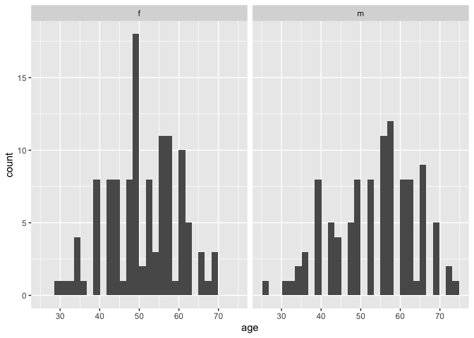

``` r
library(tidyverse)
```

```
## Warning: package 'ggplot2' was built under R version 4.5.2
```

```
## ── Attaching core tidyverse packages ──────────────────────── tidyverse 2.0.0 ──
## ✔ dplyr     1.1.4     ✔ readr     2.1.5
## ✔ forcats   1.0.0     ✔ stringr   1.5.2
## ✔ ggplot2   4.0.1     ✔ tibble    3.3.0
## ✔ lubridate 1.9.4     ✔ tidyr     1.3.1
## ✔ purrr     1.1.0     
## ── Conflicts ────────────────────────────────────────── tidyverse_conflicts() ──
## ✖ dplyr::filter() masks stats::filter()
## ✖ dplyr::lag()    masks stats::lag()
## ℹ Use the conflicted package (<http://conflicted.r-lib.org/>) to force all conflicts to become errors
```

``` r
library(gtsummary)
library(vtable)
```

```
## Loading required package: kableExtra
## 
## Attaching package: 'kableExtra'
## 
## The following object is masked from 'package:dplyr':
## 
##     group_rows
```

``` r
library(readxl)
library(reportRmd)
library(infer)
library(rstatix)
```

```
## 
## Attaching package: 'rstatix'
## 
## The following objects are masked from 'package:infer':
## 
##     chisq_test, prop_test, t_test
## 
## The following object is masked from 'package:stats':
## 
##     filter
```

## Intro to R Day 2

### Importing data set in CSV file named `data1`

Make sure you check your file extension. If you have an excel file use `readxl` package or the `GUI` 

#### Tidyverse method


``` r
data1 <- read_csv("dataset1.csv")
```

```
## Rows: 200 Columns: 11
## ── Column specification ────────────────────────────────────────────────────────
## Delimiter: ","
## dbl (11): id, sex, ethgrp, weight, age, cvd, stroke, smoking, Cancer, ldl1, ...
## 
## ℹ Use `spec()` to retrieve the full column specification for this data.
## ℹ Specify the column types or set `show_col_types = FALSE` to quiet this message.
```

``` r
## Difference between Markdown and running code
#data1 <- read_csv("data_code/data1.csv") 
```

#### Base R method


``` r
data1_base <- read.csv("dataset1.csv", header = TRUE)
```

### to see first 10 observations


``` r
head(data1,10)
```

```
## # A tibble: 10 × 11
##       id   sex ethgrp weight   age   cvd stroke smoking Cancer  ldl1  ldl2
##    <dbl> <dbl>  <dbl>  <dbl> <dbl> <dbl>  <dbl>   <dbl>  <dbl> <dbl> <dbl>
##  1     1     1      3     34    39     0      0       0      1   107   106
##  2     2     1      3     39    42     0      1       0      1   110   109
##  3     3     0      2     63    63     1      1       0      0   111   109
##  4     4     1      2     44    39     0      1       1      0   107   108
##  5     5     0      2     47    45     1      1       0      0   107   106
##  6     6     1      2     47    40     0      1       1      1   108   106
##  7     7     0      2     57    47     1      1       0      1   108   109
##  8     8     1      2     39    44     0      0       0      0   109   109
##  9     9     0      3     48    44     1      1       0      0   110   107
## 10    10     1      1     47    53     0      1       0      0   108   110
```

### Importing data set in CSV file named ‘data2’


``` r
data2 <- read_csv("dataset1.csv")
```

```
## Rows: 200 Columns: 11
## ── Column specification ────────────────────────────────────────────────────────
## Delimiter: ","
## dbl (11): id, sex, ethgrp, weight, age, cvd, stroke, smoking, Cancer, ldl1, ...
## 
## ℹ Use `spec()` to retrieve the full column specification for this data.
## ℹ Specify the column types or set `show_col_types = FALSE` to quiet this message.
```

### Merging data1 and data2

First we want to create two artificial datasets to merge. We are just going to select a few variables from each then put the data back together.


``` r
data1 <- dplyr::select(data1, id, sex, ethgrp, weight, age, cvd)
data2 <- dplyr::select(data2, id, stroke, smoking, Cancer, ldl1, ldl2)
```

### Joining data 

In computer science the term is join. Some stat software uses the term merge. 


``` r
data_merge <- dplyr::full_join(data1, data2) 
```

```
## Joining with `by = join_by(id)`
```

``` r
data_merge1 <- dplyr::full_join(data1, data2, by = join_by(id))

data_merge2 <- dplyr::full_join(data1, data2,by = join_by(id == id))

vt(data_merge)
```

<table class="table" style="color: black; margin-left: auto; margin-right: auto;">
<caption>data_merge</caption>
 <thead>
  <tr>
   <th style="text-align:left;"> Name </th>
   <th style="text-align:left;"> Class </th>
   <th style="text-align:left;"> Values </th>
  </tr>
 </thead>
<tbody>
  <tr>
   <td style="text-align:left;"> id </td>
   <td style="text-align:left;"> numeric </td>
   <td style="text-align:left;"> Num: 1 to 200 </td>
  </tr>
  <tr>
   <td style="text-align:left;"> sex </td>
   <td style="text-align:left;"> numeric </td>
   <td style="text-align:left;"> Num: 0 to 1 </td>
  </tr>
  <tr>
   <td style="text-align:left;"> ethgrp </td>
   <td style="text-align:left;"> numeric </td>
   <td style="text-align:left;"> Num: 1 to 3 </td>
  </tr>
  <tr>
   <td style="text-align:left;"> weight </td>
   <td style="text-align:left;"> numeric </td>
   <td style="text-align:left;"> Num: 28 to 76 </td>
  </tr>
  <tr>
   <td style="text-align:left;"> age </td>
   <td style="text-align:left;"> numeric </td>
   <td style="text-align:left;"> Num: 26 to 74 </td>
  </tr>
  <tr>
   <td style="text-align:left;"> cvd </td>
   <td style="text-align:left;"> numeric </td>
   <td style="text-align:left;"> Num: 0 to 1 </td>
  </tr>
  <tr>
   <td style="text-align:left;"> stroke </td>
   <td style="text-align:left;"> numeric </td>
   <td style="text-align:left;"> Num: 0 to 1 </td>
  </tr>
  <tr>
   <td style="text-align:left;"> smoking </td>
   <td style="text-align:left;"> numeric </td>
   <td style="text-align:left;"> Num: 0 to 1 </td>
  </tr>
  <tr>
   <td style="text-align:left;"> Cancer </td>
   <td style="text-align:left;"> numeric </td>
   <td style="text-align:left;"> Num: 0 to 1 </td>
  </tr>
  <tr>
   <td style="text-align:left;"> ldl1 </td>
   <td style="text-align:left;"> numeric </td>
   <td style="text-align:left;"> Num: 104 to 111 </td>
  </tr>
  <tr>
   <td style="text-align:left;"> ldl2 </td>
   <td style="text-align:left;"> numeric </td>
   <td style="text-align:left;"> Num: 106 to 110 </td>
  </tr>
</tbody>
</table>

### Importing test data


``` r
test <- read_csv("test.csv")
```

```
## Rows: 220 Columns: 12
## ── Column specification ────────────────────────────────────────────────────────
## Delimiter: ","
## chr  (1): gender
## dbl (11): id, sex, ethgrp, weight, age, cvd, stroke, smoking, Cancer, ldl1, ...
## 
## ℹ Use `spec()` to retrieve the full column specification for this data.
## ℹ Specify the column types or set `show_col_types = FALSE` to quiet this message.
```

``` r
head(test,10)
```

```
## # A tibble: 10 × 12
##       id   sex ethgrp weight   age   cvd stroke smoking Cancer  ldl1  ldl2
##    <dbl> <dbl>  <dbl>  <dbl> <dbl> <dbl>  <dbl>   <dbl>  <dbl> <dbl> <dbl>
##  1     1     1      3     34    39     0      0       0      1   107   106
##  2     2     1      3     39    42     0      1       0      1   110   109
##  3     3     0      2     63    63     1      1       0      0   111   109
##  4     4     1      2     44    39     0      1       1      0   107   108
##  5     5     0      2     47    45     1      1       0      0   107   106
##  6     6     1      2     47    40     0      1       1      1   108   106
##  7     7     0      2     57    47     1      1       0      1   108   109
##  8     8     1      2     39    44     0      0       0      0   109   109
##  9     9     0      3     48    44     1      1       0      0   110   107
## 10    10     1      1     47    53     0      1       0      0   108   110
## # ℹ 1 more variable: gender <chr>
```

``` r
glimpse(test)
```

```
## Rows: 220
## Columns: 12
## $ id      <dbl> 1, 2, 3, 4, 5, 6, 7, 8, 9, 10, 11, 12, 13, 14, 15, 16, 17, 18,…
## $ sex     <dbl> 1, 1, 0, 1, 0, 1, 0, 1, 0, 1, 0, 0, 1, 0, 0, 0, 1, 0, 1, 0, 0,…
## $ ethgrp  <dbl> 3, 3, 2, 2, 2, 2, 2, 2, 3, 1, 2, 3, 3, 2, 3, 3, 2, 3, 1, 2, 1,…
## $ weight  <dbl> 34, 39, 63, 44, 47, 47, 57, 39, 48, 47, 34, 37, 47, 47, 39, 47…
## $ age     <dbl> 39, 42, 63, 39, 45, 40, 47, 44, 44, 53, 39, 39, 47, 42, 26, 36…
## $ cvd     <dbl> 0, 0, 1, 0, 1, 0, 1, 0, 1, 0, 0, 0, 1, 1, 1, 1, 0, 1, 0, 0, 1,…
## $ stroke  <dbl> 0, 1, 1, 1, 1, 1, 1, 0, 1, 1, 1, 1, 0, 1, 1, 1, 1, 1, 0, 1, 1,…
## $ smoking <dbl> 0, 0, 0, 1, 0, 1, 0, 0, 0, 0, 0, 1, 0, 0, 0, 1, 1, 1, 0, 1, 1,…
## $ Cancer  <dbl> 1, 1, 0, 0, 0, 1, 1, 0, 0, 0, 1, 1, 1, 0, 0, 0, 0, 1, 1, 1, 1,…
## $ ldl1    <dbl> 107, 110, 111, 107, 107, 108, 108, 109, 110, 108, 108, 106, 10…
## $ ldl2    <dbl> 106, 109, 109, 108, 106, 106, 109, 109, 107, 110, 110, 108, 10…
## $ gender  <chr> "f", "f", "m", "f", "m", "f", "m", "f", "m", "f", "m", "m", "f…
```

### Create categorial variable ‘agecat’ using age

Here we are introducing three new things `%>%` (`pipe operator`), `mutate`, and `case_when`

* `%>%` or `|>` (`pipe operator`) = Signifies to run the analysis and move down to the next function. 
* `mutate` = The verb for create a new variable from an old variable
* `case_when`= An `if_else` type function 


``` r
### Tidyverse Method
test %>% summary(age)
```

```
##        id              sex             ethgrp          weight     
##  Min.   :  1.00   Min.   :0.0000   Min.   :1.000   Min.   :28.00  
##  1st Qu.: 55.75   1st Qu.:0.0000   1st Qu.:2.000   1st Qu.:44.75  
##  Median :110.50   Median :1.0000   Median :2.000   Median :51.00  
##  Mean   :110.50   Mean   :0.5318   Mean   :2.023   Mean   :52.09  
##  3rd Qu.:165.25   3rd Qu.:1.0000   3rd Qu.:2.000   3rd Qu.:60.00  
##  Max.   :220.00   Max.   :1.0000   Max.   :3.000   Max.   :76.00  
##       age             cvd             stroke          smoking      
##  Min.   :26.00   Min.   :0.0000   Min.   :0.0000   Min.   :0.0000  
##  1st Qu.:44.00   1st Qu.:0.0000   1st Qu.:0.0000   1st Qu.:0.0000  
##  Median :53.00   Median :0.0000   Median :1.0000   Median :0.0000  
##  Mean   :52.34   Mean   :0.4591   Mean   :0.6636   Mean   :0.4682  
##  3rd Qu.:61.00   3rd Qu.:1.0000   3rd Qu.:1.0000   3rd Qu.:1.0000  
##  Max.   :74.00   Max.   :1.0000   Max.   :1.0000   Max.   :1.0000  
##      Cancer            ldl1            ldl2          gender         
##  Min.   :0.0000   Min.   :104.0   Min.   :106.0   Length:220        
##  1st Qu.:0.0000   1st Qu.:106.0   1st Qu.:107.0   Class :character  
##  Median :1.0000   Median :108.0   Median :108.0   Mode  :character  
##  Mean   :0.5045   Mean   :107.7   Mean   :107.8                     
##  3rd Qu.:1.0000   3rd Qu.:109.0   3rd Qu.:109.0                     
##  Max.   :1.0000   Max.   :111.0   Max.   :110.0
```

``` r
### Base R Method
summary(test$age)
```

```
##    Min. 1st Qu.  Median    Mean 3rd Qu.    Max. 
##   26.00   44.00   53.00   52.34   61.00   74.00
```

#### Recoding Age


``` r
test <- test %>% 
          mutate(age_cat = case_when(
            age < 45 ~ "<45",
            age >= 45 & age < 50 ~ "45-49",
            age >= 50 & age < 59 ~ "50-59",
            age >= 60 & age < 65 ~ "60-64",  
            TRUE ~ "65+"
          ))

table(test$age, test$age_cat)
```

```
##     
##      <45 45-49 50-59 60-64 65+
##   26   1     0     0     0   0
##   29   1     0     0     0   0
##   31   2     0     0     0   0
##   33   2     0     0     0   0
##   34   5     0     0     0   0
##   35   1     0     0     0   0
##   36   4     0     0     0   0
##   39  14     0     0     0   0
##   40   2     0     0     0   0
##   42  13     0     0     0   0
##   44  11     0     0     0   0
##   45   0     1     0     0   0
##   46   0     1     0     0   0
##   47   0    11     0     0   0
##   48   0     2     0     0   0
##   49   0     2     0     0   0
##   50   0     0    24     0   0
##   51   0     0     2     0   0
##   53   0     0    16     0   0
##   54   0     0     3     0   0
##   55   0     0    20     0   0
##   56   0     0     2     0   0
##   57   0     0     1     0   0
##   58   0     0    22     0   0
##   59   0     0     0     0   1
##   61   0     0     0    18   0
##   63   0     0     0    13   0
##   64   0     0     0     1   0
##   65   0     0     0     0   1
##   66   0     0     0     0  11
##   67   0     0     0     0   1
##   69   0     0     0     0   8
##   72   0     0     0     0   2
##   74   0     0     0     0   1
```


``` r
### Tidyverse Method
test %>% count(age_cat)
```

```
## # A tibble: 5 × 2
##   age_cat     n
##   <chr>   <int>
## 1 45-49      17
## 2 50-59      90
## 3 60-64      32
## 4 65+        25
## 5 <45        56
```

``` r
### Base R Method
count(test, age_cat)
```

```
## # A tibble: 5 × 2
##   age_cat     n
##   <chr>   <int>
## 1 45-49      17
## 2 50-59      90
## 3 60-64      32
## 4 65+        25
## 5 <45        56
```

### Writing a test to see if that worked


``` r
### Base R Method
table(test$age, test$age_cat)
```

```
##     
##      <45 45-49 50-59 60-64 65+
##   26   1     0     0     0   0
##   29   1     0     0     0   0
##   31   2     0     0     0   0
##   33   2     0     0     0   0
##   34   5     0     0     0   0
##   35   1     0     0     0   0
##   36   4     0     0     0   0
##   39  14     0     0     0   0
##   40   2     0     0     0   0
##   42  13     0     0     0   0
##   44  11     0     0     0   0
##   45   0     1     0     0   0
##   46   0     1     0     0   0
##   47   0    11     0     0   0
##   48   0     2     0     0   0
##   49   0     2     0     0   0
##   50   0     0    24     0   0
##   51   0     0     2     0   0
##   53   0     0    16     0   0
##   54   0     0     3     0   0
##   55   0     0    20     0   0
##   56   0     0     2     0   0
##   57   0     0     1     0   0
##   58   0     0    22     0   0
##   59   0     0     0     0   1
##   61   0     0     0    18   0
##   63   0     0     0    13   0
##   64   0     0     0     1   0
##   65   0     0     0     0   1
##   66   0     0     0     0  11
##   67   0     0     0     0   1
##   69   0     0     0     0   8
##   72   0     0     0     0   2
##   74   0     0     0     0   1
```

### Check frequency distribution of a categorical variable

#### Check frequency distribution of gender


``` r
table(test$gender)
```

```
## 
##   f   m 
## 117 103
```

#### Cross tabulation of gender and stroke


``` r
table(test$gender, test$stroke)
```

```
##    
##      0  1
##   f 50 67
##   m 24 79
```

#### Recoding other variables

#### Recoding Ethnicity


``` r
table(test$ethgrp)
```

```
## 
##   1   2   3 
##  49 117  54
```

``` r
test <- test %>% 
          mutate(ethnicity = case_when(
            ethgrp == 1 ~ "Black",
            ethgrp == 2 ~ "White",
            ethgrp == 3 ~ "Other"
          ))

table(test$ethgrp, test$ethnicity)
```

```
##    
##     Black Other White
##   1    49     0     0
##   2     0     0   117
##   3     0    54     0
```

## Create a table 1

### vtable package


``` r
st(test) 
```

<table class="table" style="color: black; margin-left: auto; margin-right: auto;">
<caption>Summary Statistics</caption>
 <thead>
  <tr>
   <th style="text-align:left;"> Variable </th>
   <th style="text-align:left;"> N </th>
   <th style="text-align:left;"> Mean </th>
   <th style="text-align:left;"> Std. Dev. </th>
   <th style="text-align:left;"> Min </th>
   <th style="text-align:left;"> Pctl. 25 </th>
   <th style="text-align:left;"> Pctl. 75 </th>
   <th style="text-align:left;"> Max </th>
  </tr>
 </thead>
<tbody>
  <tr>
   <td style="text-align:left;"> id </td>
   <td style="text-align:left;"> 220 </td>
   <td style="text-align:left;"> 110 </td>
   <td style="text-align:left;"> 64 </td>
   <td style="text-align:left;"> 1 </td>
   <td style="text-align:left;"> 56 </td>
   <td style="text-align:left;"> 165 </td>
   <td style="text-align:left;"> 220 </td>
  </tr>
  <tr>
   <td style="text-align:left;"> sex </td>
   <td style="text-align:left;"> 220 </td>
   <td style="text-align:left;"> 0.53 </td>
   <td style="text-align:left;"> 0.5 </td>
   <td style="text-align:left;"> 0 </td>
   <td style="text-align:left;"> 0 </td>
   <td style="text-align:left;"> 1 </td>
   <td style="text-align:left;"> 1 </td>
  </tr>
  <tr>
   <td style="text-align:left;"> ethgrp </td>
   <td style="text-align:left;"> 220 </td>
   <td style="text-align:left;"> 2 </td>
   <td style="text-align:left;"> 0.69 </td>
   <td style="text-align:left;"> 1 </td>
   <td style="text-align:left;"> 2 </td>
   <td style="text-align:left;"> 2 </td>
   <td style="text-align:left;"> 3 </td>
  </tr>
  <tr>
   <td style="text-align:left;"> weight </td>
   <td style="text-align:left;"> 220 </td>
   <td style="text-align:left;"> 52 </td>
   <td style="text-align:left;"> 10 </td>
   <td style="text-align:left;"> 28 </td>
   <td style="text-align:left;"> 45 </td>
   <td style="text-align:left;"> 60 </td>
   <td style="text-align:left;"> 76 </td>
  </tr>
  <tr>
   <td style="text-align:left;"> age </td>
   <td style="text-align:left;"> 220 </td>
   <td style="text-align:left;"> 52 </td>
   <td style="text-align:left;"> 9.9 </td>
   <td style="text-align:left;"> 26 </td>
   <td style="text-align:left;"> 44 </td>
   <td style="text-align:left;"> 61 </td>
   <td style="text-align:left;"> 74 </td>
  </tr>
  <tr>
   <td style="text-align:left;"> cvd </td>
   <td style="text-align:left;"> 220 </td>
   <td style="text-align:left;"> 0.46 </td>
   <td style="text-align:left;"> 0.5 </td>
   <td style="text-align:left;"> 0 </td>
   <td style="text-align:left;"> 0 </td>
   <td style="text-align:left;"> 1 </td>
   <td style="text-align:left;"> 1 </td>
  </tr>
  <tr>
   <td style="text-align:left;"> stroke </td>
   <td style="text-align:left;"> 220 </td>
   <td style="text-align:left;"> 0.66 </td>
   <td style="text-align:left;"> 0.47 </td>
   <td style="text-align:left;"> 0 </td>
   <td style="text-align:left;"> 0 </td>
   <td style="text-align:left;"> 1 </td>
   <td style="text-align:left;"> 1 </td>
  </tr>
  <tr>
   <td style="text-align:left;"> smoking </td>
   <td style="text-align:left;"> 220 </td>
   <td style="text-align:left;"> 0.47 </td>
   <td style="text-align:left;"> 0.5 </td>
   <td style="text-align:left;"> 0 </td>
   <td style="text-align:left;"> 0 </td>
   <td style="text-align:left;"> 1 </td>
   <td style="text-align:left;"> 1 </td>
  </tr>
  <tr>
   <td style="text-align:left;"> Cancer </td>
   <td style="text-align:left;"> 220 </td>
   <td style="text-align:left;"> 0.5 </td>
   <td style="text-align:left;"> 0.5 </td>
   <td style="text-align:left;"> 0 </td>
   <td style="text-align:left;"> 0 </td>
   <td style="text-align:left;"> 1 </td>
   <td style="text-align:left;"> 1 </td>
  </tr>
  <tr>
   <td style="text-align:left;"> ldl1 </td>
   <td style="text-align:left;"> 220 </td>
   <td style="text-align:left;"> 108 </td>
   <td style="text-align:left;"> 1.6 </td>
   <td style="text-align:left;"> 104 </td>
   <td style="text-align:left;"> 106 </td>
   <td style="text-align:left;"> 109 </td>
   <td style="text-align:left;"> 111 </td>
  </tr>
  <tr>
   <td style="text-align:left;"> ldl2 </td>
   <td style="text-align:left;"> 220 </td>
   <td style="text-align:left;"> 108 </td>
   <td style="text-align:left;"> 1.3 </td>
   <td style="text-align:left;"> 106 </td>
   <td style="text-align:left;"> 107 </td>
   <td style="text-align:left;"> 109 </td>
   <td style="text-align:left;"> 110 </td>
  </tr>
  <tr>
   <td style="text-align:left;"> gender </td>
   <td style="text-align:left;"> 220 </td>
   <td style="text-align:left;">  </td>
   <td style="text-align:left;">  </td>
   <td style="text-align:left;">  </td>
   <td style="text-align:left;">  </td>
   <td style="text-align:left;">  </td>
   <td style="text-align:left;">  </td>
  </tr>
  <tr>
   <td style="text-align:left;"> ... f </td>
   <td style="text-align:left;"> 117 </td>
   <td style="text-align:left;"> 53% </td>
   <td style="text-align:left;">  </td>
   <td style="text-align:left;">  </td>
   <td style="text-align:left;">  </td>
   <td style="text-align:left;">  </td>
   <td style="text-align:left;">  </td>
  </tr>
  <tr>
   <td style="text-align:left;"> ... m </td>
   <td style="text-align:left;"> 103 </td>
   <td style="text-align:left;"> 47% </td>
   <td style="text-align:left;">  </td>
   <td style="text-align:left;">  </td>
   <td style="text-align:left;">  </td>
   <td style="text-align:left;">  </td>
   <td style="text-align:left;">  </td>
  </tr>
  <tr>
   <td style="text-align:left;"> age_cat </td>
   <td style="text-align:left;"> 220 </td>
   <td style="text-align:left;">  </td>
   <td style="text-align:left;">  </td>
   <td style="text-align:left;">  </td>
   <td style="text-align:left;">  </td>
   <td style="text-align:left;">  </td>
   <td style="text-align:left;">  </td>
  </tr>
  <tr>
   <td style="text-align:left;"> ... &lt;45 </td>
   <td style="text-align:left;"> 56 </td>
   <td style="text-align:left;"> 25% </td>
   <td style="text-align:left;">  </td>
   <td style="text-align:left;">  </td>
   <td style="text-align:left;">  </td>
   <td style="text-align:left;">  </td>
   <td style="text-align:left;">  </td>
  </tr>
  <tr>
   <td style="text-align:left;"> ... 45-49 </td>
   <td style="text-align:left;"> 17 </td>
   <td style="text-align:left;"> 8% </td>
   <td style="text-align:left;">  </td>
   <td style="text-align:left;">  </td>
   <td style="text-align:left;">  </td>
   <td style="text-align:left;">  </td>
   <td style="text-align:left;">  </td>
  </tr>
  <tr>
   <td style="text-align:left;"> ... 50-59 </td>
   <td style="text-align:left;"> 90 </td>
   <td style="text-align:left;"> 41% </td>
   <td style="text-align:left;">  </td>
   <td style="text-align:left;">  </td>
   <td style="text-align:left;">  </td>
   <td style="text-align:left;">  </td>
   <td style="text-align:left;">  </td>
  </tr>
  <tr>
   <td style="text-align:left;"> ... 60-64 </td>
   <td style="text-align:left;"> 32 </td>
   <td style="text-align:left;"> 15% </td>
   <td style="text-align:left;">  </td>
   <td style="text-align:left;">  </td>
   <td style="text-align:left;">  </td>
   <td style="text-align:left;">  </td>
   <td style="text-align:left;">  </td>
  </tr>
  <tr>
   <td style="text-align:left;"> ... 65+ </td>
   <td style="text-align:left;"> 25 </td>
   <td style="text-align:left;"> 11% </td>
   <td style="text-align:left;">  </td>
   <td style="text-align:left;">  </td>
   <td style="text-align:left;">  </td>
   <td style="text-align:left;">  </td>
   <td style="text-align:left;">  </td>
  </tr>
  <tr>
   <td style="text-align:left;"> ethnicity </td>
   <td style="text-align:left;"> 220 </td>
   <td style="text-align:left;">  </td>
   <td style="text-align:left;">  </td>
   <td style="text-align:left;">  </td>
   <td style="text-align:left;">  </td>
   <td style="text-align:left;">  </td>
   <td style="text-align:left;">  </td>
  </tr>
  <tr>
   <td style="text-align:left;"> ... Black </td>
   <td style="text-align:left;"> 49 </td>
   <td style="text-align:left;"> 22% </td>
   <td style="text-align:left;">  </td>
   <td style="text-align:left;">  </td>
   <td style="text-align:left;">  </td>
   <td style="text-align:left;">  </td>
   <td style="text-align:left;">  </td>
  </tr>
  <tr>
   <td style="text-align:left;"> ... Other </td>
   <td style="text-align:left;"> 54 </td>
   <td style="text-align:left;"> 25% </td>
   <td style="text-align:left;">  </td>
   <td style="text-align:left;">  </td>
   <td style="text-align:left;">  </td>
   <td style="text-align:left;">  </td>
   <td style="text-align:left;">  </td>
  </tr>
  <tr>
   <td style="text-align:left;"> ... White </td>
   <td style="text-align:left;"> 117 </td>
   <td style="text-align:left;"> 53% </td>
   <td style="text-align:left;">  </td>
   <td style="text-align:left;">  </td>
   <td style="text-align:left;">  </td>
   <td style="text-align:left;">  </td>
   <td style="text-align:left;">  </td>
  </tr>
</tbody>
</table>

### reportRmd package


``` r
rm_covsum(data = test, 
          covs = c('age', 'gender', 'ethnicity', 'stroke', 'Cancer', 'cvd'),
          show.tests=TRUE)        
```

<table class="table table" style="color: black; margin-left: auto; margin-right: auto; color: black; margin-left: auto; margin-right: auto;">
 <thead>
  <tr>
   <th style="text-align:left;position: sticky; top:0; background-color: #FFFFFF;">  </th>
   <th style="text-align:right;position: sticky; top:0; background-color: #FFFFFF;"> n=220 </th>
  </tr>
 </thead>
<tbody>
  <tr>
   <td style="text-align:left;"> <span style="font-weight: bold;">age</span> </td>
   <td style="text-align:right;">  </td>
  </tr>
  <tr>
   <td style="text-align:left;padding-left: 2em;" indentlevel="1"> Mean (sd) </td>
   <td style="text-align:right;"> 52.3 (9.9) </td>
  </tr>
  <tr>
   <td style="text-align:left;padding-left: 2em;" indentlevel="1"> Median (Min,Max) </td>
   <td style="text-align:right;"> 53 (26, 74) </td>
  </tr>
  <tr>
   <td style="text-align:left;"> <span style="font-weight: bold;">gender</span> </td>
   <td style="text-align:right;">  </td>
  </tr>
  <tr>
   <td style="text-align:left;padding-left: 2em;" indentlevel="1"> f </td>
   <td style="text-align:right;"> 117 (53) </td>
  </tr>
  <tr>
   <td style="text-align:left;padding-left: 2em;" indentlevel="1"> m </td>
   <td style="text-align:right;"> 103 (47) </td>
  </tr>
  <tr>
   <td style="text-align:left;"> <span style="font-weight: bold;">ethnicity</span> </td>
   <td style="text-align:right;">  </td>
  </tr>
  <tr>
   <td style="text-align:left;padding-left: 2em;" indentlevel="1"> Black </td>
   <td style="text-align:right;"> 49 (22) </td>
  </tr>
  <tr>
   <td style="text-align:left;padding-left: 2em;" indentlevel="1"> Other </td>
   <td style="text-align:right;"> 54 (25) </td>
  </tr>
  <tr>
   <td style="text-align:left;padding-left: 2em;" indentlevel="1"> White </td>
   <td style="text-align:right;"> 117 (53) </td>
  </tr>
  <tr>
   <td style="text-align:left;"> <span style="font-weight: bold;">stroke</span> </td>
   <td style="text-align:right;">  </td>
  </tr>
  <tr>
   <td style="text-align:left;padding-left: 2em;" indentlevel="1"> Mean (sd) </td>
   <td style="text-align:right;"> 0.7 (0.5) </td>
  </tr>
  <tr>
   <td style="text-align:left;padding-left: 2em;" indentlevel="1"> Median (Min,Max) </td>
   <td style="text-align:right;"> 1 (0, 1) </td>
  </tr>
  <tr>
   <td style="text-align:left;"> <span style="font-weight: bold;">Cancer</span> </td>
   <td style="text-align:right;">  </td>
  </tr>
  <tr>
   <td style="text-align:left;padding-left: 2em;" indentlevel="1"> Mean (sd) </td>
   <td style="text-align:right;"> 0.5 (0.5) </td>
  </tr>
  <tr>
   <td style="text-align:left;padding-left: 2em;" indentlevel="1"> Median (Min,Max) </td>
   <td style="text-align:right;"> 1 (0, 1) </td>
  </tr>
  <tr>
   <td style="text-align:left;"> <span style="font-weight: bold;">cvd</span> </td>
   <td style="text-align:right;">  </td>
  </tr>
  <tr>
   <td style="text-align:left;padding-left: 2em;" indentlevel="1"> Mean (sd) </td>
   <td style="text-align:right;"> 0.5 (0.5) </td>
  </tr>
  <tr>
   <td style="text-align:left;padding-left: 2em;" indentlevel="1"> Median (Min,Max) </td>
   <td style="text-align:right;"> 0 (0, 1) </td>
  </tr>
</tbody>
</table>

### Chi-square test 

Lots of the previous existing packages work with traditional coding rather than Tidyverse style. Here we are going to work on some of those older methods. If you want to use the newer versions use the [infer](https://infer.tidymodels.org/index.html) package. 

> A chi-squared test (also chi-square or χ2 test) is a statistical hypothesis test used in the analysis of contingency tables when the sample sizes are large. In simpler terms, this test is primarily used to examine whether two categorical variables (two dimensions of the contingency table) are independent in influencing the test statistic. [Wiki](https://en.wikipedia.org/wiki/Chi-squared_test)


``` r
### Tidyverse
test$stroke_factor <- as.factor(test$stroke)

table(test$gender, test$stroke)
```

```
##    
##      0  1
##   f 50 67
##   m 24 79
```

``` r
infer::chisq_test(test, gender ~ stroke_factor)  ## Not on conflicting packages
```

```
## # A tibble: 1 × 3
##   statistic chisq_df p_value
##       <dbl>    <int>   <dbl>
## 1      8.42        1 0.00372
```

``` r
### Base R
chisq.test(test$gender, test$stroke)
```

```
## 
## 	Pearson's Chi-squared test with Yates' continuity correction
## 
## data:  test$gender and test$stroke
## X-squared = 8.4179, df = 1, p-value = 0.003715
```

### Fishers exact test

> Fisher's exact test is a statistical significance test used in the analysis of contingency tables. Although in practice it is employed when sample sizes are small, it is valid for all sample sizes. [Wiki](https://en.wikipedia.org/wiki/Fisher%27s_exact_test)


``` r
xtab <- table(test$gender, test$stroke)

### Tidyverse
fisher_test(xtab, detailed = TRUE)
```

```
## # A tibble: 1 × 8
##       n estimate       p conf.low conf.high method          alternative p.signif
## * <int>    <dbl>   <dbl>    <dbl>     <dbl> <chr>           <chr>       <chr>   
## 1   220     2.45 0.00267     1.32      4.63 Fisher's Exact… two.sided   **
```

``` r
### Base R
fisher.test(test$gender, test$stroke)
```

```
## 
## 	Fisher's Exact Test for Count Data
## 
## data:  test$gender and test$stroke
## p-value = 0.002674
## alternative hypothesis: true odds ratio is not equal to 1
## 95 percent confidence interval:
##  1.318319 4.628560
## sample estimates:
## odds ratio 
##   2.446347
```

## Shapiro Wilk Test

> The null-hypothesis of this test is that the population is normally distributed. If the p value is less than the chosen alpha level, then the null hypothesis is rejected and there is evidence that the data tested are not normally distributed.[Wiki](https://en.wikipedia.org/wiki/Shapiro%E2%80%93Wilk_test)

#### First, we check if data follow Normal distribution
#### Normality test (if p>0.05: data are normally distributed)
####  Want to compare mean ages between male and female

####  Check histogtam

``` r
hist_age_gender <- ggplot(test, aes(age)) +
  geom_histogram() + 
  facet_wrap(~ gender)

plot(hist_age_gender)
```

```
## `stat_bin()` using `bins = 30`. Pick better value `binwidth`.
```

<!-- -->

### Shapiro test females


``` r
test_data_female <- filter(test, gender == "f")
shapiro.test(test_data_female$age)
```

```
## 
## 	Shapiro-Wilk normality test
## 
## data:  test_data_female$age
## W = 0.98305, p-value = 0.1477
```

#### Shapiro test males


``` r
test_data_male <- filter(test, gender == "m")
shapiro.test(test_data_male$age)
```

```
## 
## 	Shapiro-Wilk normality test
## 
## data:  test_data_male$age
## W = 0.96989, p-value = 0.01883
```

## t-test

> Student's t-test is a statistical test used to test whether the difference between the response of two groups is statistically significant or not. It is any statistical hypothesis test in which the test statistic follows a Student's t-distribution under the null hypothesis. [Wiki](https://en.wikipedia.org/wiki/Student%27s_t-test)

Lots of things we can do with t-tests. Generic formalution for many tests is `test_function`(`variable1` ~ `variable1`, data = `my_data`)


``` r
help(t.test)
t.test(age ~ gender, data = test, var.equal = FALSE)
```

```
## 
## 	Welch Two Sample t-test
## 
## data:  age by gender
## t = -1.9624, df = 200.25, p-value = 0.05111
## alternative hypothesis: true difference in means between group f and group m is not equal to 0
## 95 percent confidence interval:
##  -5.26625331  0.01274738
## sample estimates:
## mean in group f mean in group m 
##        51.11111        53.73786
```

### Check variance


``` r
var.test(age ~ gender, data = test)
```

```
## 
## 	F test to compare two variances
## 
## data:  age by gender
## F = 0.70681, num df = 116, denom df = 102, p-value = 0.07034
## alternative hypothesis: true ratio of variances is not equal to 1
## 95 percent confidence interval:
##  0.4830964 1.0293364
## sample estimates:
## ratio of variances 
##          0.7068141
```

### Variances are equal based on the test


``` r
t.test(age ~ gender, data = test, var.equal = TRUE)
```

```
## 
## 	Two Sample t-test
## 
## data:  age by gender
## t = -1.984, df = 218, p-value = 0.04851
## alternative hypothesis: true difference in means between group f and group m is not equal to 0
## 95 percent confidence interval:
##  -5.23613291 -0.01737302
## sample estimates:
## mean in group f mean in group m 
##        51.11111        53.73786
```

## Wilcoxon signed-rank test

### Non-parametric test if data are not normally distributed

> The Wilcoxon signed-rank test is a non-parametric rank test for statistical hypothesis testing used either to test the location of a population based on a sample of data, or to compare the locations of two populations using two matched samples. The one-sample version serves a purpose similar to that of the one-sample Student's t-test. For two matched samples, it is a paired difference test like the paired Student's t-test (also known as the "t-test for matched pairs" or "t-test for dependent samples"). [Wiki](https://en.wikipedia.org/wiki/Wilcoxon_signed-rank_test)


``` r
wilcox.test(age ~ gender, data = test)
```

```
## 
## 	Wilcoxon rank sum test with continuity correction
## 
## data:  age by gender
## W = 5020, p-value = 0.03246
## alternative hypothesis: true location shift is not equal to 0
```

### Paired t-test for two dependent samples


``` r
t.test(test$ldl1, test$ldl2, paired = TRUE, var.equal = FALSE)
```

```
## 
## 	Paired t-test
## 
## data:  test$ldl1 and test$ldl2
## t = -0.5298, df = 219, p-value = 0.5968
## alternative hypothesis: true mean difference is not equal to 0
## 95 percent confidence interval:
##  -0.3003634  0.1730907
## sample estimates:
## mean difference 
##     -0.06363636
```

## Pearson correlation coefficient

> In statistics, the Pearson correlation coefficient is a correlation coefficient that measures linear correlation between two sets of data. It is the ratio between the covariance of two variables and the product of their standard deviations; thus, it is essentially a normalized measurement of the covariance, such that the result always has a value between −1 and 1. [Wiki](https://en.wikipedia.org/wiki/Pearson_correlation_coefficient)


``` r
cor.test(test$ldl1, test$ldl2,  method = "pearson") 
```

```
## 
## 	Pearson's product-moment correlation
## 
## data:  test$ldl1 and test$ldl2
## t = 4.1684, df = 218, p-value = 4.425e-05
## alternative hypothesis: true correlation is not equal to 0
## 95 percent confidence interval:
##  0.1446265 0.3899574
## sample estimates:
##       cor 
## 0.2717003
```

## Spearman correlation coefficient

> In statistics, Spearman's rank correlation coefficient or Spearman's ρ is a number ranging from -1 to 1 that indicates how strongly two sets of ranks are correlated. It could be used in a situation where one only has ranked data, such as a tally of gold, silver, and bronze medals. [Wiki](https://en.wikipedia.org/wiki/Spearman%27s_rank_correlation_coefficient)


``` r
cor.test(test$ldl1, test$ldl2,  method = "spearman") 
```

```
## Warning in cor.test.default(test$ldl1, test$ldl2, method = "spearman"): Cannot
## compute exact p-value with ties
```

```
## 
## 	Spearman's rank correlation rho
## 
## data:  test$ldl1 and test$ldl2
## S = 1339899, p-value = 0.0002436
## alternative hypothesis: true rho is not equal to 0
## sample estimates:
##       rho 
## 0.2449701
```

## Linear regression

Conduct linear regression model between dependent and independent variables. Age is continuous, gender is categorical, ldl is continuous variable.

> In statistics, linear regression is a model that estimates the relationship between a scalar response (dependent variable) and one or more explanatory variables (regressor or independent variable). A model with exactly one explanatory variable is a simple linear regression; a model with two or more explanatory variables is a multiple linear regression. This term is distinct from multivariate linear regression, which predicts multiple correlated dependent variables rather than a single dependent variable. [Wiki](https://en.wikipedia.org/wiki/Linear_regression#Estimation_methods)


``` r
linear_model <- lm(age ~ as.factor(gender) + ldl1, data = test)
summary(linear_model)
```

```
## 
## Call:
## lm(formula = age ~ as.factor(gender) + ldl1, data = test)
## 
## Residuals:
##     Min      1Q  Median      3Q     Max 
## -27.487  -6.891   0.999   7.366  20.219 
## 
## Coefficients:
##                    Estimate Std. Error t value Pr(>|t|)  
## (Intercept)         35.2826    43.8978   0.804   0.4224  
## as.factor(gender)m   2.6331     1.3267   1.985   0.0484 *
## ldl1                 0.1469     0.4073   0.361   0.7187  
## ---
## Signif. codes:  0 '***' 0.001 '**' 0.01 '*' 0.05 '.' 0.1 ' ' 1
## 
## Residual standard error: 9.818 on 217 degrees of freedom
## Multiple R-squared:  0.01832,	Adjusted R-squared:  0.009277 
## F-statistic: 2.025 on 2 and 217 DF,  p-value: 0.1344
```

``` r
gtsummary::tbl_regression(linear_model)
```

```{=html}
<div id="nkrkfrphrt" style="padding-left:0px;padding-right:0px;padding-top:10px;padding-bottom:10px;overflow-x:auto;overflow-y:auto;width:auto;height:auto;">
<style>#nkrkfrphrt table {
  font-family: system-ui, 'Segoe UI', Roboto, Helvetica, Arial, sans-serif, 'Apple Color Emoji', 'Segoe UI Emoji', 'Segoe UI Symbol', 'Noto Color Emoji';
  -webkit-font-smoothing: antialiased;
  -moz-osx-font-smoothing: grayscale;
}

#nkrkfrphrt thead, #nkrkfrphrt tbody, #nkrkfrphrt tfoot, #nkrkfrphrt tr, #nkrkfrphrt td, #nkrkfrphrt th {
  border-style: none;
}

#nkrkfrphrt p {
  margin: 0;
  padding: 0;
}

#nkrkfrphrt .gt_table {
  display: table;
  border-collapse: collapse;
  line-height: normal;
  margin-left: auto;
  margin-right: auto;
  color: #333333;
  font-size: 16px;
  font-weight: normal;
  font-style: normal;
  background-color: #FFFFFF;
  width: auto;
  border-top-style: solid;
  border-top-width: 2px;
  border-top-color: #A8A8A8;
  border-right-style: none;
  border-right-width: 2px;
  border-right-color: #D3D3D3;
  border-bottom-style: solid;
  border-bottom-width: 2px;
  border-bottom-color: #A8A8A8;
  border-left-style: none;
  border-left-width: 2px;
  border-left-color: #D3D3D3;
}

#nkrkfrphrt .gt_caption {
  padding-top: 4px;
  padding-bottom: 4px;
}

#nkrkfrphrt .gt_title {
  color: #333333;
  font-size: 125%;
  font-weight: initial;
  padding-top: 4px;
  padding-bottom: 4px;
  padding-left: 5px;
  padding-right: 5px;
  border-bottom-color: #FFFFFF;
  border-bottom-width: 0;
}

#nkrkfrphrt .gt_subtitle {
  color: #333333;
  font-size: 85%;
  font-weight: initial;
  padding-top: 3px;
  padding-bottom: 5px;
  padding-left: 5px;
  padding-right: 5px;
  border-top-color: #FFFFFF;
  border-top-width: 0;
}

#nkrkfrphrt .gt_heading {
  background-color: #FFFFFF;
  text-align: center;
  border-bottom-color: #FFFFFF;
  border-left-style: none;
  border-left-width: 1px;
  border-left-color: #D3D3D3;
  border-right-style: none;
  border-right-width: 1px;
  border-right-color: #D3D3D3;
}

#nkrkfrphrt .gt_bottom_border {
  border-bottom-style: solid;
  border-bottom-width: 2px;
  border-bottom-color: #D3D3D3;
}

#nkrkfrphrt .gt_col_headings {
  border-top-style: solid;
  border-top-width: 2px;
  border-top-color: #D3D3D3;
  border-bottom-style: solid;
  border-bottom-width: 2px;
  border-bottom-color: #D3D3D3;
  border-left-style: none;
  border-left-width: 1px;
  border-left-color: #D3D3D3;
  border-right-style: none;
  border-right-width: 1px;
  border-right-color: #D3D3D3;
}

#nkrkfrphrt .gt_col_heading {
  color: #333333;
  background-color: #FFFFFF;
  font-size: 100%;
  font-weight: normal;
  text-transform: inherit;
  border-left-style: none;
  border-left-width: 1px;
  border-left-color: #D3D3D3;
  border-right-style: none;
  border-right-width: 1px;
  border-right-color: #D3D3D3;
  vertical-align: bottom;
  padding-top: 5px;
  padding-bottom: 6px;
  padding-left: 5px;
  padding-right: 5px;
  overflow-x: hidden;
}

#nkrkfrphrt .gt_column_spanner_outer {
  color: #333333;
  background-color: #FFFFFF;
  font-size: 100%;
  font-weight: normal;
  text-transform: inherit;
  padding-top: 0;
  padding-bottom: 0;
  padding-left: 4px;
  padding-right: 4px;
}

#nkrkfrphrt .gt_column_spanner_outer:first-child {
  padding-left: 0;
}

#nkrkfrphrt .gt_column_spanner_outer:last-child {
  padding-right: 0;
}

#nkrkfrphrt .gt_column_spanner {
  border-bottom-style: solid;
  border-bottom-width: 2px;
  border-bottom-color: #D3D3D3;
  vertical-align: bottom;
  padding-top: 5px;
  padding-bottom: 5px;
  overflow-x: hidden;
  display: inline-block;
  width: 100%;
}

#nkrkfrphrt .gt_spanner_row {
  border-bottom-style: hidden;
}

#nkrkfrphrt .gt_group_heading {
  padding-top: 8px;
  padding-bottom: 8px;
  padding-left: 5px;
  padding-right: 5px;
  color: #333333;
  background-color: #FFFFFF;
  font-size: 100%;
  font-weight: initial;
  text-transform: inherit;
  border-top-style: solid;
  border-top-width: 2px;
  border-top-color: #D3D3D3;
  border-bottom-style: solid;
  border-bottom-width: 2px;
  border-bottom-color: #D3D3D3;
  border-left-style: none;
  border-left-width: 1px;
  border-left-color: #D3D3D3;
  border-right-style: none;
  border-right-width: 1px;
  border-right-color: #D3D3D3;
  vertical-align: middle;
  text-align: left;
}

#nkrkfrphrt .gt_empty_group_heading {
  padding: 0.5px;
  color: #333333;
  background-color: #FFFFFF;
  font-size: 100%;
  font-weight: initial;
  border-top-style: solid;
  border-top-width: 2px;
  border-top-color: #D3D3D3;
  border-bottom-style: solid;
  border-bottom-width: 2px;
  border-bottom-color: #D3D3D3;
  vertical-align: middle;
}

#nkrkfrphrt .gt_from_md > :first-child {
  margin-top: 0;
}

#nkrkfrphrt .gt_from_md > :last-child {
  margin-bottom: 0;
}

#nkrkfrphrt .gt_row {
  padding-top: 8px;
  padding-bottom: 8px;
  padding-left: 5px;
  padding-right: 5px;
  margin: 10px;
  border-top-style: solid;
  border-top-width: 1px;
  border-top-color: #D3D3D3;
  border-left-style: none;
  border-left-width: 1px;
  border-left-color: #D3D3D3;
  border-right-style: none;
  border-right-width: 1px;
  border-right-color: #D3D3D3;
  vertical-align: middle;
  overflow-x: hidden;
}

#nkrkfrphrt .gt_stub {
  color: #333333;
  background-color: #FFFFFF;
  font-size: 100%;
  font-weight: initial;
  text-transform: inherit;
  border-right-style: solid;
  border-right-width: 2px;
  border-right-color: #D3D3D3;
  padding-left: 5px;
  padding-right: 5px;
}

#nkrkfrphrt .gt_stub_row_group {
  color: #333333;
  background-color: #FFFFFF;
  font-size: 100%;
  font-weight: initial;
  text-transform: inherit;
  border-right-style: solid;
  border-right-width: 2px;
  border-right-color: #D3D3D3;
  padding-left: 5px;
  padding-right: 5px;
  vertical-align: top;
}

#nkrkfrphrt .gt_row_group_first td {
  border-top-width: 2px;
}

#nkrkfrphrt .gt_row_group_first th {
  border-top-width: 2px;
}

#nkrkfrphrt .gt_summary_row {
  color: #333333;
  background-color: #FFFFFF;
  text-transform: inherit;
  padding-top: 8px;
  padding-bottom: 8px;
  padding-left: 5px;
  padding-right: 5px;
}

#nkrkfrphrt .gt_first_summary_row {
  border-top-style: solid;
  border-top-color: #D3D3D3;
}

#nkrkfrphrt .gt_first_summary_row.thick {
  border-top-width: 2px;
}

#nkrkfrphrt .gt_last_summary_row {
  padding-top: 8px;
  padding-bottom: 8px;
  padding-left: 5px;
  padding-right: 5px;
  border-bottom-style: solid;
  border-bottom-width: 2px;
  border-bottom-color: #D3D3D3;
}

#nkrkfrphrt .gt_grand_summary_row {
  color: #333333;
  background-color: #FFFFFF;
  text-transform: inherit;
  padding-top: 8px;
  padding-bottom: 8px;
  padding-left: 5px;
  padding-right: 5px;
}

#nkrkfrphrt .gt_first_grand_summary_row {
  padding-top: 8px;
  padding-bottom: 8px;
  padding-left: 5px;
  padding-right: 5px;
  border-top-style: double;
  border-top-width: 6px;
  border-top-color: #D3D3D3;
}

#nkrkfrphrt .gt_last_grand_summary_row_top {
  padding-top: 8px;
  padding-bottom: 8px;
  padding-left: 5px;
  padding-right: 5px;
  border-bottom-style: double;
  border-bottom-width: 6px;
  border-bottom-color: #D3D3D3;
}

#nkrkfrphrt .gt_striped {
  background-color: rgba(128, 128, 128, 0.05);
}

#nkrkfrphrt .gt_table_body {
  border-top-style: solid;
  border-top-width: 2px;
  border-top-color: #D3D3D3;
  border-bottom-style: solid;
  border-bottom-width: 2px;
  border-bottom-color: #D3D3D3;
}

#nkrkfrphrt .gt_footnotes {
  color: #333333;
  background-color: #FFFFFF;
  border-bottom-style: none;
  border-bottom-width: 2px;
  border-bottom-color: #D3D3D3;
  border-left-style: none;
  border-left-width: 2px;
  border-left-color: #D3D3D3;
  border-right-style: none;
  border-right-width: 2px;
  border-right-color: #D3D3D3;
}

#nkrkfrphrt .gt_footnote {
  margin: 0px;
  font-size: 90%;
  padding-top: 4px;
  padding-bottom: 4px;
  padding-left: 5px;
  padding-right: 5px;
}

#nkrkfrphrt .gt_sourcenotes {
  color: #333333;
  background-color: #FFFFFF;
  border-bottom-style: none;
  border-bottom-width: 2px;
  border-bottom-color: #D3D3D3;
  border-left-style: none;
  border-left-width: 2px;
  border-left-color: #D3D3D3;
  border-right-style: none;
  border-right-width: 2px;
  border-right-color: #D3D3D3;
}

#nkrkfrphrt .gt_sourcenote {
  font-size: 90%;
  padding-top: 4px;
  padding-bottom: 4px;
  padding-left: 5px;
  padding-right: 5px;
}

#nkrkfrphrt .gt_left {
  text-align: left;
}

#nkrkfrphrt .gt_center {
  text-align: center;
}

#nkrkfrphrt .gt_right {
  text-align: right;
  font-variant-numeric: tabular-nums;
}

#nkrkfrphrt .gt_font_normal {
  font-weight: normal;
}

#nkrkfrphrt .gt_font_bold {
  font-weight: bold;
}

#nkrkfrphrt .gt_font_italic {
  font-style: italic;
}

#nkrkfrphrt .gt_super {
  font-size: 65%;
}

#nkrkfrphrt .gt_footnote_marks {
  font-size: 75%;
  vertical-align: 0.4em;
  position: initial;
}

#nkrkfrphrt .gt_asterisk {
  font-size: 100%;
  vertical-align: 0;
}

#nkrkfrphrt .gt_indent_1 {
  text-indent: 5px;
}

#nkrkfrphrt .gt_indent_2 {
  text-indent: 10px;
}

#nkrkfrphrt .gt_indent_3 {
  text-indent: 15px;
}

#nkrkfrphrt .gt_indent_4 {
  text-indent: 20px;
}

#nkrkfrphrt .gt_indent_5 {
  text-indent: 25px;
}

#nkrkfrphrt .katex-display {
  display: inline-flex !important;
  margin-bottom: 0.75em !important;
}

#nkrkfrphrt div.Reactable > div.rt-table > div.rt-thead > div.rt-tr.rt-tr-group-header > div.rt-th-group:after {
  height: 0px !important;
}
</style>
<table class="gt_table" data-quarto-disable-processing="false" data-quarto-bootstrap="false">
  <thead>
    <tr class="gt_col_headings">
      <th class="gt_col_heading gt_columns_bottom_border gt_left" rowspan="1" colspan="1" scope="col" id="label"><span class='gt_from_md'><strong>Characteristic</strong></span></th>
      <th class="gt_col_heading gt_columns_bottom_border gt_center" rowspan="1" colspan="1" scope="col" id="estimate"><span class='gt_from_md'><strong>Beta</strong></span></th>
      <th class="gt_col_heading gt_columns_bottom_border gt_center" rowspan="1" colspan="1" scope="col" id="conf.low"><span class='gt_from_md'><strong>95% CI</strong></span></th>
      <th class="gt_col_heading gt_columns_bottom_border gt_center" rowspan="1" colspan="1" scope="col" id="p.value"><span class='gt_from_md'><strong>p-value</strong></span></th>
    </tr>
  </thead>
  <tbody class="gt_table_body">
    <tr><td headers="label" class="gt_row gt_left">as.factor(gender)</td>
<td headers="estimate" class="gt_row gt_center"><br /></td>
<td headers="conf.low" class="gt_row gt_center"><br /></td>
<td headers="p.value" class="gt_row gt_center"><br /></td></tr>
    <tr><td headers="label" class="gt_row gt_left">    f</td>
<td headers="estimate" class="gt_row gt_center">—</td>
<td headers="conf.low" class="gt_row gt_center">—</td>
<td headers="p.value" class="gt_row gt_center"><br /></td></tr>
    <tr><td headers="label" class="gt_row gt_left">    m</td>
<td headers="estimate" class="gt_row gt_center">2.6</td>
<td headers="conf.low" class="gt_row gt_center">0.02, 5.2</td>
<td headers="p.value" class="gt_row gt_center">0.048</td></tr>
    <tr><td headers="label" class="gt_row gt_left">ldl1</td>
<td headers="estimate" class="gt_row gt_center">0.15</td>
<td headers="conf.low" class="gt_row gt_center">-0.66, 0.95</td>
<td headers="p.value" class="gt_row gt_center">0.7</td></tr>
  </tbody>
  <tfoot>
    <tr class="gt_sourcenotes">
      <td class="gt_sourcenote" colspan="4"><span class='gt_from_md'>Abbreviation: CI = Confidence Interval</span></td>
    </tr>
  </tfoot>
</table>
</div>
```

## Logistic regression

> In statistics, a logistic model (or logit model) is a statistical model that models the log-odds of an event as a linear combination of one or more independent variables. In regression analysis, logistic regression (or logit regression) estimates the parameters of a logistic model (the coefficients in the linear or non linear combinations). [Wiki](https://en.wikipedia.org/wiki/Logistic_regression)


``` r
logistic_model <- glm(Cancer ~ as.factor(gender) + ldl1 + smoking, data = test, family = "binomial")
summary(logistic_model)
```

```
## 
## Call:
## glm(formula = Cancer ~ as.factor(gender) + ldl1 + smoking, family = "binomial", 
##     data = test)
## 
## Coefficients:
##                    Estimate Std. Error z value Pr(>|z|)    
## (Intercept)        -8.59440    9.27064  -0.927 0.353897    
## as.factor(gender)m -0.17977    0.28127  -0.639 0.522731    
## ldl1                0.07651    0.08608   0.889 0.374092    
## smoking             0.97655    0.28186   3.465 0.000531 ***
## ---
## Signif. codes:  0 '***' 0.001 '**' 0.01 '*' 0.05 '.' 0.1 ' ' 1
## 
## (Dispersion parameter for binomial family taken to be 1)
## 
##     Null deviance: 304.97  on 219  degrees of freedom
## Residual deviance: 291.22  on 216  degrees of freedom
## AIC: 299.22
## 
## Number of Fisher Scoring iterations: 4
```

### Get ORs

#### Old School Way


``` r
exp(cbind(OR = coef(logistic_model), confint(logistic_model)))
```

```
## Waiting for profiling to be done...
```

```
##                              OR        2.5 %       97.5 %
## (Intercept)        0.0001851388 2.002321e-12 13871.953855
## as.factor(gender)m 0.8354627365 4.796265e-01     1.447729
## ldl1               1.0795100764 9.121949e-01     1.279878
## smoking            2.6552733816 1.536611e+00     4.647905
```

#### New School Way

``` r
tbl_regression(logistic_model, exponentiate = TRUE) 
```

```{=html}
<div id="hxpsycjwpx" style="padding-left:0px;padding-right:0px;padding-top:10px;padding-bottom:10px;overflow-x:auto;overflow-y:auto;width:auto;height:auto;">
<style>#hxpsycjwpx table {
  font-family: system-ui, 'Segoe UI', Roboto, Helvetica, Arial, sans-serif, 'Apple Color Emoji', 'Segoe UI Emoji', 'Segoe UI Symbol', 'Noto Color Emoji';
  -webkit-font-smoothing: antialiased;
  -moz-osx-font-smoothing: grayscale;
}

#hxpsycjwpx thead, #hxpsycjwpx tbody, #hxpsycjwpx tfoot, #hxpsycjwpx tr, #hxpsycjwpx td, #hxpsycjwpx th {
  border-style: none;
}

#hxpsycjwpx p {
  margin: 0;
  padding: 0;
}

#hxpsycjwpx .gt_table {
  display: table;
  border-collapse: collapse;
  line-height: normal;
  margin-left: auto;
  margin-right: auto;
  color: #333333;
  font-size: 16px;
  font-weight: normal;
  font-style: normal;
  background-color: #FFFFFF;
  width: auto;
  border-top-style: solid;
  border-top-width: 2px;
  border-top-color: #A8A8A8;
  border-right-style: none;
  border-right-width: 2px;
  border-right-color: #D3D3D3;
  border-bottom-style: solid;
  border-bottom-width: 2px;
  border-bottom-color: #A8A8A8;
  border-left-style: none;
  border-left-width: 2px;
  border-left-color: #D3D3D3;
}

#hxpsycjwpx .gt_caption {
  padding-top: 4px;
  padding-bottom: 4px;
}

#hxpsycjwpx .gt_title {
  color: #333333;
  font-size: 125%;
  font-weight: initial;
  padding-top: 4px;
  padding-bottom: 4px;
  padding-left: 5px;
  padding-right: 5px;
  border-bottom-color: #FFFFFF;
  border-bottom-width: 0;
}

#hxpsycjwpx .gt_subtitle {
  color: #333333;
  font-size: 85%;
  font-weight: initial;
  padding-top: 3px;
  padding-bottom: 5px;
  padding-left: 5px;
  padding-right: 5px;
  border-top-color: #FFFFFF;
  border-top-width: 0;
}

#hxpsycjwpx .gt_heading {
  background-color: #FFFFFF;
  text-align: center;
  border-bottom-color: #FFFFFF;
  border-left-style: none;
  border-left-width: 1px;
  border-left-color: #D3D3D3;
  border-right-style: none;
  border-right-width: 1px;
  border-right-color: #D3D3D3;
}

#hxpsycjwpx .gt_bottom_border {
  border-bottom-style: solid;
  border-bottom-width: 2px;
  border-bottom-color: #D3D3D3;
}

#hxpsycjwpx .gt_col_headings {
  border-top-style: solid;
  border-top-width: 2px;
  border-top-color: #D3D3D3;
  border-bottom-style: solid;
  border-bottom-width: 2px;
  border-bottom-color: #D3D3D3;
  border-left-style: none;
  border-left-width: 1px;
  border-left-color: #D3D3D3;
  border-right-style: none;
  border-right-width: 1px;
  border-right-color: #D3D3D3;
}

#hxpsycjwpx .gt_col_heading {
  color: #333333;
  background-color: #FFFFFF;
  font-size: 100%;
  font-weight: normal;
  text-transform: inherit;
  border-left-style: none;
  border-left-width: 1px;
  border-left-color: #D3D3D3;
  border-right-style: none;
  border-right-width: 1px;
  border-right-color: #D3D3D3;
  vertical-align: bottom;
  padding-top: 5px;
  padding-bottom: 6px;
  padding-left: 5px;
  padding-right: 5px;
  overflow-x: hidden;
}

#hxpsycjwpx .gt_column_spanner_outer {
  color: #333333;
  background-color: #FFFFFF;
  font-size: 100%;
  font-weight: normal;
  text-transform: inherit;
  padding-top: 0;
  padding-bottom: 0;
  padding-left: 4px;
  padding-right: 4px;
}

#hxpsycjwpx .gt_column_spanner_outer:first-child {
  padding-left: 0;
}

#hxpsycjwpx .gt_column_spanner_outer:last-child {
  padding-right: 0;
}

#hxpsycjwpx .gt_column_spanner {
  border-bottom-style: solid;
  border-bottom-width: 2px;
  border-bottom-color: #D3D3D3;
  vertical-align: bottom;
  padding-top: 5px;
  padding-bottom: 5px;
  overflow-x: hidden;
  display: inline-block;
  width: 100%;
}

#hxpsycjwpx .gt_spanner_row {
  border-bottom-style: hidden;
}

#hxpsycjwpx .gt_group_heading {
  padding-top: 8px;
  padding-bottom: 8px;
  padding-left: 5px;
  padding-right: 5px;
  color: #333333;
  background-color: #FFFFFF;
  font-size: 100%;
  font-weight: initial;
  text-transform: inherit;
  border-top-style: solid;
  border-top-width: 2px;
  border-top-color: #D3D3D3;
  border-bottom-style: solid;
  border-bottom-width: 2px;
  border-bottom-color: #D3D3D3;
  border-left-style: none;
  border-left-width: 1px;
  border-left-color: #D3D3D3;
  border-right-style: none;
  border-right-width: 1px;
  border-right-color: #D3D3D3;
  vertical-align: middle;
  text-align: left;
}

#hxpsycjwpx .gt_empty_group_heading {
  padding: 0.5px;
  color: #333333;
  background-color: #FFFFFF;
  font-size: 100%;
  font-weight: initial;
  border-top-style: solid;
  border-top-width: 2px;
  border-top-color: #D3D3D3;
  border-bottom-style: solid;
  border-bottom-width: 2px;
  border-bottom-color: #D3D3D3;
  vertical-align: middle;
}

#hxpsycjwpx .gt_from_md > :first-child {
  margin-top: 0;
}

#hxpsycjwpx .gt_from_md > :last-child {
  margin-bottom: 0;
}

#hxpsycjwpx .gt_row {
  padding-top: 8px;
  padding-bottom: 8px;
  padding-left: 5px;
  padding-right: 5px;
  margin: 10px;
  border-top-style: solid;
  border-top-width: 1px;
  border-top-color: #D3D3D3;
  border-left-style: none;
  border-left-width: 1px;
  border-left-color: #D3D3D3;
  border-right-style: none;
  border-right-width: 1px;
  border-right-color: #D3D3D3;
  vertical-align: middle;
  overflow-x: hidden;
}

#hxpsycjwpx .gt_stub {
  color: #333333;
  background-color: #FFFFFF;
  font-size: 100%;
  font-weight: initial;
  text-transform: inherit;
  border-right-style: solid;
  border-right-width: 2px;
  border-right-color: #D3D3D3;
  padding-left: 5px;
  padding-right: 5px;
}

#hxpsycjwpx .gt_stub_row_group {
  color: #333333;
  background-color: #FFFFFF;
  font-size: 100%;
  font-weight: initial;
  text-transform: inherit;
  border-right-style: solid;
  border-right-width: 2px;
  border-right-color: #D3D3D3;
  padding-left: 5px;
  padding-right: 5px;
  vertical-align: top;
}

#hxpsycjwpx .gt_row_group_first td {
  border-top-width: 2px;
}

#hxpsycjwpx .gt_row_group_first th {
  border-top-width: 2px;
}

#hxpsycjwpx .gt_summary_row {
  color: #333333;
  background-color: #FFFFFF;
  text-transform: inherit;
  padding-top: 8px;
  padding-bottom: 8px;
  padding-left: 5px;
  padding-right: 5px;
}

#hxpsycjwpx .gt_first_summary_row {
  border-top-style: solid;
  border-top-color: #D3D3D3;
}

#hxpsycjwpx .gt_first_summary_row.thick {
  border-top-width: 2px;
}

#hxpsycjwpx .gt_last_summary_row {
  padding-top: 8px;
  padding-bottom: 8px;
  padding-left: 5px;
  padding-right: 5px;
  border-bottom-style: solid;
  border-bottom-width: 2px;
  border-bottom-color: #D3D3D3;
}

#hxpsycjwpx .gt_grand_summary_row {
  color: #333333;
  background-color: #FFFFFF;
  text-transform: inherit;
  padding-top: 8px;
  padding-bottom: 8px;
  padding-left: 5px;
  padding-right: 5px;
}

#hxpsycjwpx .gt_first_grand_summary_row {
  padding-top: 8px;
  padding-bottom: 8px;
  padding-left: 5px;
  padding-right: 5px;
  border-top-style: double;
  border-top-width: 6px;
  border-top-color: #D3D3D3;
}

#hxpsycjwpx .gt_last_grand_summary_row_top {
  padding-top: 8px;
  padding-bottom: 8px;
  padding-left: 5px;
  padding-right: 5px;
  border-bottom-style: double;
  border-bottom-width: 6px;
  border-bottom-color: #D3D3D3;
}

#hxpsycjwpx .gt_striped {
  background-color: rgba(128, 128, 128, 0.05);
}

#hxpsycjwpx .gt_table_body {
  border-top-style: solid;
  border-top-width: 2px;
  border-top-color: #D3D3D3;
  border-bottom-style: solid;
  border-bottom-width: 2px;
  border-bottom-color: #D3D3D3;
}

#hxpsycjwpx .gt_footnotes {
  color: #333333;
  background-color: #FFFFFF;
  border-bottom-style: none;
  border-bottom-width: 2px;
  border-bottom-color: #D3D3D3;
  border-left-style: none;
  border-left-width: 2px;
  border-left-color: #D3D3D3;
  border-right-style: none;
  border-right-width: 2px;
  border-right-color: #D3D3D3;
}

#hxpsycjwpx .gt_footnote {
  margin: 0px;
  font-size: 90%;
  padding-top: 4px;
  padding-bottom: 4px;
  padding-left: 5px;
  padding-right: 5px;
}

#hxpsycjwpx .gt_sourcenotes {
  color: #333333;
  background-color: #FFFFFF;
  border-bottom-style: none;
  border-bottom-width: 2px;
  border-bottom-color: #D3D3D3;
  border-left-style: none;
  border-left-width: 2px;
  border-left-color: #D3D3D3;
  border-right-style: none;
  border-right-width: 2px;
  border-right-color: #D3D3D3;
}

#hxpsycjwpx .gt_sourcenote {
  font-size: 90%;
  padding-top: 4px;
  padding-bottom: 4px;
  padding-left: 5px;
  padding-right: 5px;
}

#hxpsycjwpx .gt_left {
  text-align: left;
}

#hxpsycjwpx .gt_center {
  text-align: center;
}

#hxpsycjwpx .gt_right {
  text-align: right;
  font-variant-numeric: tabular-nums;
}

#hxpsycjwpx .gt_font_normal {
  font-weight: normal;
}

#hxpsycjwpx .gt_font_bold {
  font-weight: bold;
}

#hxpsycjwpx .gt_font_italic {
  font-style: italic;
}

#hxpsycjwpx .gt_super {
  font-size: 65%;
}

#hxpsycjwpx .gt_footnote_marks {
  font-size: 75%;
  vertical-align: 0.4em;
  position: initial;
}

#hxpsycjwpx .gt_asterisk {
  font-size: 100%;
  vertical-align: 0;
}

#hxpsycjwpx .gt_indent_1 {
  text-indent: 5px;
}

#hxpsycjwpx .gt_indent_2 {
  text-indent: 10px;
}

#hxpsycjwpx .gt_indent_3 {
  text-indent: 15px;
}

#hxpsycjwpx .gt_indent_4 {
  text-indent: 20px;
}

#hxpsycjwpx .gt_indent_5 {
  text-indent: 25px;
}

#hxpsycjwpx .katex-display {
  display: inline-flex !important;
  margin-bottom: 0.75em !important;
}

#hxpsycjwpx div.Reactable > div.rt-table > div.rt-thead > div.rt-tr.rt-tr-group-header > div.rt-th-group:after {
  height: 0px !important;
}
</style>
<table class="gt_table" data-quarto-disable-processing="false" data-quarto-bootstrap="false">
  <thead>
    <tr class="gt_col_headings">
      <th class="gt_col_heading gt_columns_bottom_border gt_left" rowspan="1" colspan="1" scope="col" id="label"><span class='gt_from_md'><strong>Characteristic</strong></span></th>
      <th class="gt_col_heading gt_columns_bottom_border gt_center" rowspan="1" colspan="1" scope="col" id="estimate"><span class='gt_from_md'><strong>OR</strong></span></th>
      <th class="gt_col_heading gt_columns_bottom_border gt_center" rowspan="1" colspan="1" scope="col" id="conf.low"><span class='gt_from_md'><strong>95% CI</strong></span></th>
      <th class="gt_col_heading gt_columns_bottom_border gt_center" rowspan="1" colspan="1" scope="col" id="p.value"><span class='gt_from_md'><strong>p-value</strong></span></th>
    </tr>
  </thead>
  <tbody class="gt_table_body">
    <tr><td headers="label" class="gt_row gt_left">as.factor(gender)</td>
<td headers="estimate" class="gt_row gt_center"><br /></td>
<td headers="conf.low" class="gt_row gt_center"><br /></td>
<td headers="p.value" class="gt_row gt_center"><br /></td></tr>
    <tr><td headers="label" class="gt_row gt_left">    f</td>
<td headers="estimate" class="gt_row gt_center">—</td>
<td headers="conf.low" class="gt_row gt_center">—</td>
<td headers="p.value" class="gt_row gt_center"><br /></td></tr>
    <tr><td headers="label" class="gt_row gt_left">    m</td>
<td headers="estimate" class="gt_row gt_center">0.84</td>
<td headers="conf.low" class="gt_row gt_center">0.48, 1.45</td>
<td headers="p.value" class="gt_row gt_center">0.5</td></tr>
    <tr><td headers="label" class="gt_row gt_left">ldl1</td>
<td headers="estimate" class="gt_row gt_center">1.08</td>
<td headers="conf.low" class="gt_row gt_center">0.91, 1.28</td>
<td headers="p.value" class="gt_row gt_center">0.4</td></tr>
    <tr><td headers="label" class="gt_row gt_left">smoking</td>
<td headers="estimate" class="gt_row gt_center">2.66</td>
<td headers="conf.low" class="gt_row gt_center">1.54, 4.65</td>
<td headers="p.value" class="gt_row gt_center"><0.001</td></tr>
  </tbody>
  <tfoot>
    <tr class="gt_sourcenotes">
      <td class="gt_sourcenote" colspan="4"><span class='gt_from_md'>Abbreviations: CI = Confidence Interval, OR = Odds Ratio</span></td>
    </tr>
  </tfoot>
</table>
</div>
```

### One-way ANOVA

> In statistics, one-way analysis of variance (or one-way ANOVA) is a technique to compare whether two or more samples' means are significantly different (using the F distribution). This analysis of variance technique requires a numeric response variable "Y" and a single explanatory variable "X", hence "one-way". [Wiki](https://en.wikipedia.org/wiki/One-way_analysis_of_variance)

Pass arguments to aov() function for an ANOVA test


``` r
one_anova <- aov(age ~ ethgrp, data = test)
summary(one_anova)
```

```
##              Df Sum Sq Mean Sq F value  Pr(>F)   
## ethgrp        1    816   815.7   8.677 0.00357 **
## Residuals   218  20494    94.0                   
## ---
## Signif. codes:  0 '***' 0.001 '**' 0.01 '*' 0.05 '.' 0.1 ' ' 1
```

### Non-parametric ANOVA (Kruskal–Wallis test)

> The Kruskal–Wallis test by ranks, Kruskal–Wallis H {\displaystyle H} test (named after William Kruskal and W. Allen Wallis), or one-way ANOVA on ranks is a non-parametric statistical test for testing whether samples originate from the same distribution. It is used for comparing two or more independent samples of equal or different sample sizes. It extends the Mann–Whitney U test, which is used for comparing only two groups. [Wiki](https://en.wikipedia.org/wiki/Kruskal%E2%80%93Wallis_test)


``` r
kruskal.test(age ~ ethgrp, data = test)
```

```
## 
## 	Kruskal-Wallis rank sum test
## 
## data:  age by ethgrp
## Kruskal-Wallis chi-squared = 15.426, df = 2, p-value = 0.000447
```
