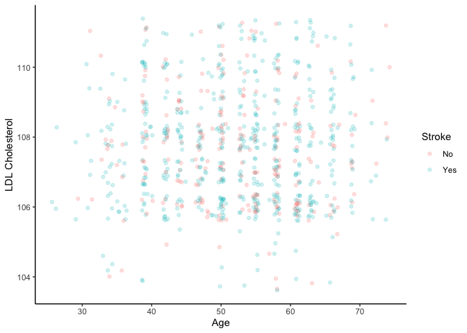
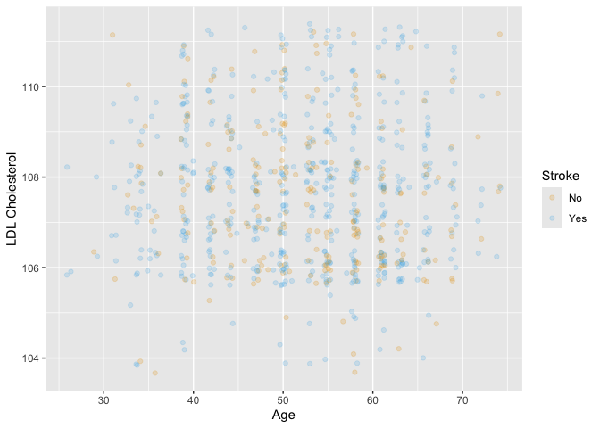
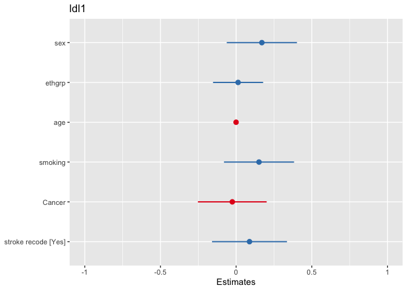
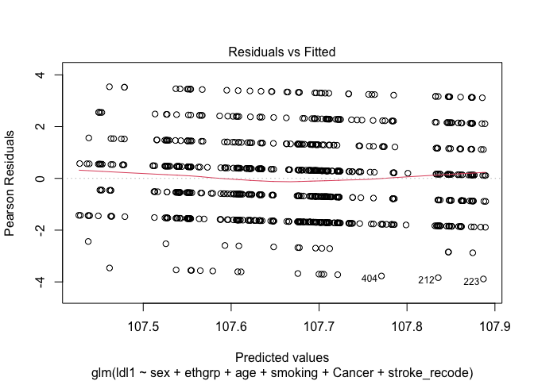
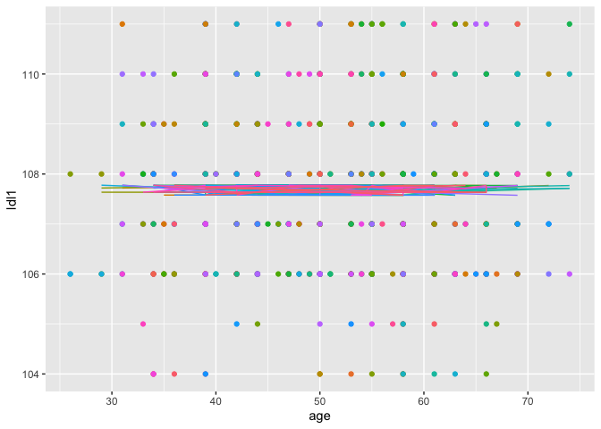

``` r
library(tidyverse)
```

```
## Warning: package 'ggplot2' was built under R version 4.5.2
```

```
## ── Attaching core tidyverse packages ──────────────────────── tidyverse 2.0.0 ──
## ✔ dplyr     1.1.4     ✔ readr     2.1.5
## ✔ forcats   1.0.0     ✔ stringr   1.5.2
## ✔ ggplot2   4.0.1     ✔ tibble    3.3.0
## ✔ lubridate 1.9.4     ✔ tidyr     1.3.1
## ✔ purrr     1.1.0     
## ── Conflicts ────────────────────────────────────────── tidyverse_conflicts() ──
## ✖ dplyr::filter() masks stats::filter()
## ✖ dplyr::lag()    masks stats::lag()
## ℹ Use the conflicted package (<http://conflicted.r-lib.org/>) to force all conflicts to become errors
```

``` r
### Reading in other datasets
library(haven)
library(readxl)
library(httpuv)
library(googlesheets4)

### Missing data
library(visdat)
library(naniar)

### Functions for visualizing regression
library(gtsummary)
library(sjPlot)
```

```
## 
## Attaching package: 'sjPlot'
## 
## The following object is masked from 'package:ggplot2':
## 
##     set_theme
```

``` r
library(interactions)
library(cardx)
library(randomNames)
```

## Reading other data sources 

From the `haven` documentation: [https://haven.tidyverse.org/reference/index.html](https://haven.tidyverse.org/reference/index.html)

### Labelled vectors

SAS, SPSS, and Stata share a simply concept of “labelled” vectors, which are similar to factors but a little more general. The `labelled()` class provides a natural representaion in R.

`labelled_spss()`
    Labelled vectors for SPSS

`labelled()` `is.labelled()`
    Create a labelled vector.

`print_labels()`
    Print the labels of a labelled vector

`as_factor(<data.frame>)` `as_factor(<haven_labelled>)` `as_factor(<labelled>)`
    Convert labelled vectors to factors

### Tagged missing values

Both SAS and Stata supported tagged missing values, where a missing value can have multiple “types”, given by an letter from A through Z. `tagged_na()` provides a convenient way of representing these types of missing values in R by taking advantage of the binary representation of NA.

`tagged_na()` `na_tag()` `is_tagged_na()` `format_tagged_na()` `print_tagged_na()`
    "Tagged" missing values

Remove attributes

__There are a number of SPSS/SAS/Stata features that have no direct equivalent in R.__ Haven preserves them so you can choose what do with them. To simply eliminate them, use one of the zap functions.

`zap_empty()`
    Convert empty strings into missing values

`zap_formats()`
    Remove format attributes

`zap_label()`
    Zap variable labels

`zap_labels()`
    Zap value labels

`zap_missing()`
    Zap special missings to regular R missings

`zap_widths()`
    Remove display width attributes 

### Read SPSS Data


``` r
data_spss <- read_sav("data_spss.sav")
```

### Read SAS Data

SAS has two data formats, `xpt` and `sas7bdat` formats. Here we are only going to how the `xpt` method but it's very similar. 


``` r
data_sas <- read_xpt("data_sas.xpt")
```

### Read Stata


``` r
data_stata <- read_dta("data_stata.dta")
```

### Read Excel

This is from the `readxl` package. Extremely powerful for reading in excel files. 


``` r
data_excel <- read_excel("data_all.xlsx", sheet = "data_all")
```

### Read Google Sheets

To get Google Sheets package to work we need to authenticate our Google Drive. The sheet needs to be shared to this can get a bit complicated. If it's in your own Google Sheets that's easy enough. 

##### NOT RUN

```{}
data_google <- read_sheet("https://docs.google.com/spreadsheets/d/1vGwx9rpdKX--wqS0LShyXbwm_GSG-tiNuiBdwSk7xPY/edit?gid=391891818#gid=391891818")
```

## Missing Data

So far we have not included any missing data. In the real world there will definitely by missingness in your data. R handles missing data a bit differently from the other common software. 


``` r
data_missing <- read_csv("data_missing.csv")
```

```
## Rows: 800 Columns: 11
## ── Column specification ────────────────────────────────────────────────────────
## Delimiter: ","
## dbl (11): id, sex, ethgrp, weight, age, cvd, stroke, smoking, Cancer, ldl1, ...
## 
## ℹ Use `spec()` to retrieve the full column specification for this data.
## ℹ Specify the column types or set `show_col_types = FALSE` to quiet this message.
```

## Ways R encodes missing(ish) data

### NaN and Inf are related to NA.

#### NaN

NaN represents `Not a Number`. NaN can be generated, for example, by taking the log of a negative number. They can be tested for with is.nan()


``` r
x <- log(c(1, -1, NA))
```

```
## Warning in log(c(1, -1, NA)): NaNs produced
```

``` r
x
```

```
## [1]   0 NaN  NA
```

``` r
is.nan(x)
```

```
## [1] FALSE  TRUE FALSE
```

#### Inf

Inf and -Inf represent positive and negative infinite numbers respectively. These can be generated, for example, by dividing by zero, and tested for with is.infinite()


``` r
y <- c(-Inf, 0, Inf)
is.infinite(y)
```

```
## [1]  TRUE FALSE  TRUE
```

### Comparison of missing types

The test is.finite() it TRUE if the value is numeric and not NA, NaN, Inf or -Inf.

 value |	is.na |	is.nan |	is.infinite |	is.finite 
 ----- | ------ | ------ | ------ 
 1 	| FALSE |	FALSE |	FALSE |	TRUE
 NA 	| TRUE |	FALSE |	FALSE |	FALSE
 NaN |	TRUE |	TRUE |	FALSE |	FALSE
 Inf |	FALSE |	FALSE |	TRUE |	FALSE
 -Inf |	FALSE |	FALSE |	TRUE |	FALSE

## Missing data analysis

#### We want a quick summary of missing data for each variable. This function is from the `naniar` package. We have lots of variables so let's save this as a table that we inspect a little easier. 


``` r
missing_table <- miss_var_summary(data_missing)
missing_table
```

```
## # A tibble: 11 × 3
##    variable n_miss pct_miss
##    <chr>     <int>    <num>
##  1 id           80       10
##  2 sex          80       10
##  3 ethgrp       80       10
##  4 weight       80       10
##  5 age          80       10
##  6 cvd          80       10
##  7 stroke       80       10
##  8 smoking      80       10
##  9 Cancer       80       10
## 10 ldl1         80       10
## 11 ldl2         80       10
```

Now that we have a more manageable dataframe let's visualize missing with the package `visdat` to quickly visualize the entire dataframe and check missing.


``` r
vis_dat(data_missing)
```

<!-- -->

We have fixed the problem with logical variables and those with too much missing to do anything with really. Now let's move on to what we can actually do. 

## You got some SPSS data! 

When you are dealing with missing values, you might want to replace values with a missing values (NA). This is useful in cases when you know the origin of the data and can be certain which values should be missing. For example, you might know that all values of “N/A”, “N A”, and “Not Available”, or -99, or -1 are supposed to be missing.

naniar provides functions to specifically work on this type of problem using the function replace_with_na. This function is the compliment to tidyr::replace_na, which replaces an NA value with a specified value, whereas naniar::replace_with_na replaces a value with an NA:

* `tidyr::replace_na`: Missing values turns into a value (NA –> -99)
* `naniar::replace_with_na`: Value becomes a missing value (-99 –> NA)


## Data Wrangling 

Let's say we have a bunch of different datasets we need to combine together in some way. There are many ways to do this. The cheat sheet for `dplyr` can help with this. It provides nice visuals if you are trying to combine datasets. Here is a snip of it. The full cheat sheet is available here [https://rstudio.github.io/cheatsheets/html/data-transformation.html](https://rstudio.github.io/cheatsheets/html/data-transformation.html)


``` r
data1 <- read_csv("dataset1.csv")
```

```
## Rows: 200 Columns: 11
## ── Column specification ────────────────────────────────────────────────────────
## Delimiter: ","
## dbl (11): id, sex, ethgrp, weight, age, cvd, stroke, smoking, Cancer, ldl1, ...
## 
## ℹ Use `spec()` to retrieve the full column specification for this data.
## ℹ Specify the column types or set `show_col_types = FALSE` to quiet this message.
```

### Joining datasets

#### Stacking 2 datasets on top of each other

If we want to stack two datasets we need to use the `bind` set of functions. We can either use `bind_rows` or `bind_cols` from the `tidyverse` set of packages to do this. Let's say we have two datasets with the same information but different participants. We want to stack them so we can do some bigger analysis. 


``` r
data2 <- read_csv("dataset2.csv")
```

```
## Rows: 200 Columns: 11
## ── Column specification ────────────────────────────────────────────────────────
## Delimiter: ","
## dbl (11): id, sex, ethgrp, weight, age, cvd, stroke, smoking, Cancer, ldl1, ...
## 
## ℹ Use `spec()` to retrieve the full column specification for this data.
## ℹ Specify the column types or set `show_col_types = FALSE` to quiet this message.
```

``` r
data3 <- read_csv("dataset3.csv")
```

```
## Rows: 200 Columns: 11
## ── Column specification ────────────────────────────────────────────────────────
## Delimiter: ","
## dbl (11): id, sex, ethgrp, weight, age, cvd, stroke, smoking, Cancer, ldl1, ...
## 
## ℹ Use `spec()` to retrieve the full column specification for this data.
## ℹ Specify the column types or set `show_col_types = FALSE` to quiet this message.
```

``` r
data4 <- read_csv("dataset4.csv")
```

```
## Rows: 200 Columns: 11
## ── Column specification ────────────────────────────────────────────────────────
## Delimiter: ","
## dbl (11): id, sex, ethgrp, weight, age, cvd, stroke, smoking, Cancer, ldl1, ...
## 
## ℹ Use `spec()` to retrieve the full column specification for this data.
## ℹ Specify the column types or set `show_col_types = FALSE` to quiet this message.
```

Data1 and Data2 have the some number and information in the columns but they are not together. We can join them using `bind_rows`. Some notes on this

* All variables need to have the same name
* Variables with the same name need to have the same type (eg. numeric)
    * If you have a variable names `id` and it's factor in one dataset and numeric in the other the function will not work
* All variables need to be in all datasets
    * If you have a `cholestrol` variable that is only in one dataset the function will not work


``` r
data_all <- bind_rows(data1, data2, data3, data4)

#write_csv(data_all, "data_all.csv")
```

#### Advanced

We can also do more advanced things like select and bind all of the files in a folder with a specific filename or file extension. 


``` r
paths <- list.files(pattern = "dataset.*\\.csv", full.names = TRUE)
paths
```

```
## [1] "./dataset1.csv" "./dataset2.csv" "./dataset3.csv" "./dataset4.csv"
```

``` r
files <- map(paths, read_csv)
```

```
## Rows: 200 Columns: 11
## ── Column specification ────────────────────────────────────────────────────────
## Delimiter: ","
## dbl (11): id, sex, ethgrp, weight, age, cvd, stroke, smoking, Cancer, ldl1, ...
## 
## ℹ Use `spec()` to retrieve the full column specification for this data.
## ℹ Specify the column types or set `show_col_types = FALSE` to quiet this message.
## Rows: 200 Columns: 11
## ── Column specification ────────────────────────────────────────────────────────
## Delimiter: ","
## dbl (11): id, sex, ethgrp, weight, age, cvd, stroke, smoking, Cancer, ldl1, ...
## 
## ℹ Use `spec()` to retrieve the full column specification for this data.
## ℹ Specify the column types or set `show_col_types = FALSE` to quiet this message.
## Rows: 200 Columns: 11
## ── Column specification ────────────────────────────────────────────────────────
## Delimiter: ","
## dbl (11): id, sex, ethgrp, weight, age, cvd, stroke, smoking, Cancer, ldl1, ...
## 
## ℹ Use `spec()` to retrieve the full column specification for this data.
## ℹ Specify the column types or set `show_col_types = FALSE` to quiet this message.
## Rows: 200 Columns: 11
## ── Column specification ────────────────────────────────────────────────────────
## Delimiter: ","
## dbl (11): id, sex, ethgrp, weight, age, cvd, stroke, smoking, Cancer, ldl1, ...
## 
## ℹ Use `spec()` to retrieve the full column specification for this data.
## ℹ Specify the column types or set `show_col_types = FALSE` to quiet this message.
```

``` r
length(files)
```

```
## [1] 4
```

``` r
data_test <- list_rbind(files)
summary(data_test)
```

```
##        id             sex            ethgrp         weight           age       
##  Min.   :  1.0   Min.   :0.000   Min.   :1.00   Min.   :28.00   Min.   :26.00  
##  1st Qu.:200.0   1st Qu.:0.000   1st Qu.:2.00   1st Qu.:44.00   1st Qu.:44.00  
##  Median :399.5   Median :1.000   Median :2.00   Median :50.00   Median :53.00  
##  Mean   :399.8   Mean   :0.585   Mean   :1.99   Mean   :52.23   Mean   :51.89  
##  3rd Qu.:599.2   3rd Qu.:1.000   3rd Qu.:2.00   3rd Qu.:60.00   3rd Qu.:59.50  
##  Max.   :799.0   Max.   :1.000   Max.   :3.00   Max.   :76.00   Max.   :74.00  
##       cvd             stroke          smoking           Cancer      
##  Min.   :0.0000   Min.   :0.0000   Min.   :0.0000   Min.   :0.0000  
##  1st Qu.:0.0000   1st Qu.:0.0000   1st Qu.:0.0000   1st Qu.:0.0000  
##  Median :0.0000   Median :1.0000   Median :0.0000   Median :1.0000  
##  Mean   :0.4088   Mean   :0.6813   Mean   :0.4425   Mean   :0.5025  
##  3rd Qu.:1.0000   3rd Qu.:1.0000   3rd Qu.:1.0000   3rd Qu.:1.0000  
##  Max.   :1.0000   Max.   :1.0000   Max.   :1.0000   Max.   :1.0000  
##       ldl1            ldl2      
##  Min.   :104.0   Min.   :106.0  
##  1st Qu.:106.0   1st Qu.:107.0  
##  Median :108.0   Median :108.0  
##  Mean   :107.7   Mean   :107.8  
##  3rd Qu.:109.0   3rd Qu.:109.0  
##  Max.   :111.0   Max.   :110.0
```

``` r
#write_csv(data_all, "data_all.csv")
```

2. Join by ID

If you have 2 datasets with different data that you want to join you can use different join methods. These terms are from computer science. `full_join`, `left_join`, `right_join`, etc. 


``` r
names_data <- read_csv("names.csv")
```

```
## Rows: 800 Columns: 2
## ── Column specification ────────────────────────────────────────────────────────
## Delimiter: ","
## chr (1): parent
## dbl (1): id
## 
## ℹ Use `spec()` to retrieve the full column specification for this data.
## ℹ Specify the column types or set `show_col_types = FALSE` to quiet this message.
```

``` r
glimpse(names_data)
```

```
## Rows: 800
## Columns: 2
## $ id     <dbl> 1, 2, 3, 4, 5, 6, 7, 8, 9, 10, 11, 12, 13, 14, 15, 16, 17, 18, …
## $ parent <chr> "Cesar", "Brandon", "Molly", "Mathew", "Gabrielle", "Chloe", "H…
```

``` r
data_all <- left_join(data_all, names_data, by = join_by(id))
table(data_all$parent)
```

```
## 
##          Aadil          Aasim   Abdul Baasid  Abdul Fattaah      Abdul Hai 
##              1              2              1              1              1 
##   Abdul Kareem   Abdul Waahid        Abigail           Adau        Adilene 
##              2              1              1              1              1 
##         Aditya          Adjoa         Adrena          Adria        Adriana 
##              1              1              1              1              1 
##         Afraah          Aidan         Aikeem         Aileen          Aiman 
##              2              1              1              1              1 
##      Aireyonna           Alan          Alana         Alanna         Albert 
##              1              1              1              1              1 
##        Alberto           Alec      Alejandra         Alethe      Alexander 
##              1              1              1              1              5 
##      Alexandra     Alexandria         Alexis        Alfonso            Ali 
##              1              2              2              1              1 
##        Aliceia         Alicia Aliciagabriela          Alisa         Alisha 
##              2              1              1              1              2 
##         Almira          Alyna         Alyssa          Amara          Amaya 
##              1              1              1              1              1 
##          Amber         Ameera         Ammaar        Ammanda            Amy 
##              3              1              1              1              1 
##            Ana       Analicia       Anamaria         Andrea         Andres 
##              3              1              1              1              1 
##         Andrew          Angel       Angelica       Angelina           Anna 
##              2              2              3              2              3 
##        Anthony        Antwonn          Anwar          April        Arafaat 
##              1              1              1              1              1 
##         Arissa       Arrlando        Asashia            Ash        Ashante 
##              1              1              1              1              1 
##       Ashleigh         Ashley       Ashlynnd          Asmaa         Athena 
##              1              5              1              1              1 
##         Aubrey         Audrey        Aujonte         Austin         Autumn 
##              1              2              1              2              1 
##         Ayyoob         Baaqir        Badraan          Badri     Badruddeen 
##              1              1              1              1              1 
##         Baheej         Bailey         Baosan           Beau            Ben 
##              1              1              1              1              1 
##        Bethany         Bobbie        Bradley         Brandi        Brandon 
##              1              1              1              1              6 
##        Braxton         Breana        Breanna         Brenda          Brian 
##              1              1              1              1              1 
##         Bristi        Britney       Brittany Brittanyclaire         Brooks 
##              1              1              4              1              1 
##          Bruce          Bryce         Caigen        Cameron         Cannon 
##              1              1              1              1              1 
##           Carl       Carle Je         Carlos        Carmela       Caroline 
##              1              1              1              1              1 
##        Carrell         Carson       Casandra          Casey        Cassidy 
##              1              2              1              1              1 
##      Catherine         Celine      Celistina          Cesar        Chaerin 
##              2              1              1              3              1 
##         Chance       Charisma       Charlene        Charles      Charlotte 
##              2              1              2              2              1 
##          Chase        Chelsey       Cheyenne          Chloe       Chrissie 
##              1              1              1              1              1 
##      Christian      Christina    Christopher          Ciera        Claudia 
##              3              1              3              1              1 
##           Cody          Colby           Cole         Collin         Colton 
##              1              1              1              1              1 
##           Cora       Courtney        Cristal         Crysta        Cynthia 
##              1              1              1              1              1 
##         Daijon         Dakota         Damian         Damien          Damon 
##              1              1              2              1              1 
##         Daniel       Danielle          David         Davina          Davis 
##              5              4              4              1              1 
##     Dayveontay          De'On         Deanna         Deeana         Dekota 
##              1              1              1              1              1 
##      Demetrius        Desiree        Destiny          Devin          Diana 
##              1              1              2              1              2 
##             Do       Doan Anh        Dominic       Dominika      Dominique 
##              1              1              2              1              1 
##         Dontae         Dustin          Dylan          Edgar         Edrick 
##              1              1              2              1              1 
##         Edward         Eemoni         Elijah      Elizabeth           Elsa 
##              1              1              1              2              1 
##         Emilio          Emily           Emma       Emmanuel         Erasmo 
##              1              2              1              1              1 
##           Eric         Erkhes      Estefania         Estela          Ester 
##              1              1              2              1              1 
##          Ethan         Eun-Ji           Evan         Evelyn        Faarooq 
##              2              1              1              1              1 
##         Faatin          Fawzi         Faydra       Fernanda        Frances 
##              1              1              1              1              1 
##          Frank     Fransiscus      Frederick      Friedrich      Gabriella 
##              1              1              1              1              1 
##      Gabrielle         Garett        Gavriel      Genevieve       Ghaaziya 
##              1              1              1              1              1 
##       Gilberto        Giorgio      Gow Xhoua          Grace         Gracie 
##              1              1              1              1              1 
##          Grant        Gregory      Guadalupe      Guillermo         Hailey 
##              1              1              2              1              1 
##          Haley          Hamdi          Hamsa        Haniyya         Hannah 
##              1              1              1              1              3 
##         Harley        Harmony         Harold          Hasan           Hawe 
##              1              1              1              1              1 
##         Haylie        Heather         Heddie          Holly           Hope 
##              1              1              1              1              1 
##            Hui         Hunter          Huong       Ignatius          Ihaab 
##              1              1              1              1              1 
##         Ilhaam          Imani       Intisaar          Isaac         Isabel 
##              1              1              1              2              1 
##       Isabelle         Isaiah         Ishaaq         Iyonna          Izzat 
##              1              1              1              1              1 
##           Jack        Jackson          Jacob           Jade        Jaelynn 
##              1              2              2              1              1 
##          Jaime         Jakees          Jalen         Jalynn          Jamal 
##              1              1              1              1              1 
##        Jameela          James          Janae        Janelle          Janet 
##              1              1              1              1              1 
##         Jaquay          Jared        Jarrade        Jazzmin       Jennifer 
##              1              1              1              1              3 
##          Jenny         Jeremy        Jessica         Jessie          Jiair 
##              1              1              2              1              1 
##          Jingo           Joel           John    John-Wesley       Jonathan 
##              1              1              2              1              1 
##       Jonothan        Jordahn         Jordan       Jordynne          Josef 
##              1              1              4              1              1 
##         Joshua       Jourdayn           Juan    Juan Daniel        Juanita 
##              5              1              2              1              1 
##          Julia       Julianna         Junior         Justen        Justice 
##              1              2              1              1              1 
##         Justin        Justina        Justine       K'Sandra          Kacey 
##              1              1              1              1              1 
##        Kahliya            Kai        Kaitlyn        Kameela         Kamrin 
##              1              1              2              1              1 
##       Kanchana          Karen           Kari          Karin          Karla 
##              1              3              1              1              2 
##      Kassandra         Kateri       Katerine      Katherine       Katheryn 
##              1              1              1              3              1 
##        Kathryn        Katrina        Kayanna         Kaycee          Kayla 
##              1              1              1              1              4 
##         Kaylea       Keishawn          Keith          Kelia          Kelly 
##              1              1              1              1              3 
##         Kelsey   Kelton David            Ken         Kendra         Kendyl 
##              1              1              1              2              1 
##        Kennedy          Kenny          Kevin       Khaleefa           Khoa 
##              1              1              2              1              1 
##         Kiante          Kiara         Kierra           Kile         Kinsey 
##              1              2              1              1              1 
##        Kirsten           Kloe       Kristina     Kristopher           Kyle 
##              1              1              1              1              3 
##        Kylejon           Kyra         Labeeb          Ladan        Ladonna 
##              1              1              2              1              1 
##           Lady          Lance        Lateefa         Lauren        Layaali 
##              1              1              1              2              1 
##        Leandra           Leia           Leon         Leslie          Lexis 
##              1              1              1              1              1 
##            Lia          Linda        Lindsey          Logan           Lois 
##              1              1              1              2              1 
##          Londa          Lorna          Lucas          Lucky           Luis 
##              1              1              1              1              1 
##          Lukas       Lutfiyya          Macey      Mackenzie        Madalyn 
##              1              2              1              2              1 
##      Madeleine        Madison        Mahalia            Mai           Maia 
##              1              2              1              1              1 
##         Manaal          Mandy         Manuel      Manuelito           Mara 
##              1              1              1              1              1 
##          Maria         Mariah         Marina          Mario         Marisa 
##              2              4              1              1              1 
##         Mariya        Markkus       Marquise         Martin         Marvin 
##              1              1              1              1              1 
##        Marwaan          Mason       Masroora        Mastoor         Mathew 
##              1              1              1              1              1 
##        Mathias        Matthew        Maurice           Maya       Mckenzie 
##              1              4              1              5              1 
##        Mechale          Melia        Melissa        Michael       Michelle 
##              1              1              1              4              3 
##        Mieisha         Miguel        Mikalah        Mikayla         Milton 
##              1              1              1              1              1 
##           Minh       Minkyung         Minnah         Minuri        Miranda 
##              1              1              1              1              1 
##       Mitchell        Mohamed         Moises          Molly         Mone'T 
##              2              1              1              1              1 
##        Monique         Morgan         Moriah      Mu,Aawiya     Mubashshir 
##              1              3              1              1              1 
##         Muhsin            Mun        Musaaid        Musfira         Muslim 
##              1              1              1              1              1 
##        Mustaba          Myong         Mystic        Na'Inoa        Nafeesa 
##              1              1              1              1              2 
##         Najeeb        Najeema        Najiyya        Nakheel         Nariah 
##              1              1              1              1              1 
##        Naseera       Nashelle         Nathan      Nathaniel         Nawaar 
##              1              1              2              1              1 
##       Nawwaara          Nbyee         Nelisa       Nicholas        Nichole 
##              1              1              1              3              1 
##     Nickolette          Niecy          Niomi         Nizaar           Nuha 
##              1              1              1              1              1 
##           Omar          Pablo        Paisley         Pamela           Paul 
##              1              1              1              1              2 
##          Pearl          Pedro         Peyton         Prisca          Qaaid 
##              1              1              1              1              1 
##        Raabiya          Raafi           Rabi        Rachael         Rachel 
##              1              1              1              1              3 
##       Rachelee        Rafeeda        Raheema        Raihaan         Ramesh 
##              1              1              1              1              1 
##       Randilyn         Rashad        Rashele           Raul          Rawda 
##              1              1              1              1              1 
##         Razeen        Rebecca         Reilly        Rhianna           Rian 
##              1              1              1              1              1 
##        Ricardo        Richard         Rickia          Rifat         Robert 
##              1              2              1              1              1 
##          Roman         Ronald        Ronnell        Roselyn         Roshae 
##              1              2              1              1              1 
##         Rushdi        Rutaiba           Ryan         Saabir        Saabira 
##              1              1              2              1              1 
##       Saafiyya        Saaliha        Saarang            Sad          Saeed 
##              1              1              1              1              1 
##           Saje        Sajiyya       Samantha        Sameeha         Samuel 
##              1              1              1              1              2 
##        Sanakee         Sandra       Sapphire           Sara          Sarah 
##              1              2              1              2              5 
##           Saul       Savannah           Sean         Sergio           Seth 
##              1              1              1              1              1 
##         Shaafi        Shaakir       Shaakira       Shaamila       Shaddaad 
##              1              1              1              1              1 
##       Shafeeqa        Shakeel       Shakeela        Shakeer       Shakoora 
##              1              1              1              1              1 
##          Shane         Shania        Shannon           Shay         Shayla 
##              1              1              1              1              1 
##         Shelby       Shontice        Shuraih        Si Hien         Sierra 
##              1              1              1              1              1 
##        Silvano         Smokey            Sri         Stacie       Stefanie 
##              1              1              1              1              1 
##        Stephon       Stephvon         Steven         Stevie          Suhaa 
##              1              1              3              1              1 
##         Suhaad         Sultan        Sumayya         Summer         Sydney 
##              1              1              1              1              2 
##          Tahma        Tamanna          Tanay        Tanisha         Tantai 
##              1              1              1              1              1 
##           Taqi        Tashina       Tausolia        Tavares        Tawfeeq 
##              1              1              1              1              1 
##         Tayler         Taylor         Tayyib       Terrance    Thanh Huong 
##              1              6              1              1              1 
##       Theodore         Thomas         Tiesha        Timothy           Tina 
##              1              1              1              1              1 
##       Toniosha          Torey       Torriane           Trae        Traivon 
##              1              1              1              1              1 
##           Tran         Travis            Tre          Trent         Trevon 
##              1              1              1              1              1 
##           Trey       Tristian           Tuan          Turfa             Ty 
##              1              1              2              1              1 
##         Tyesha          Tyler          Tyree          Tyrel          Tyrin 
##              1              5              1              2              1 
##         Ubaida        Ulysses         Umaira         Usaama         Vanesa 
##              1              1              1              1              1 
##        Vanessa         Vianey       Victoria          Vilok        Vincent 
##              5              1              1              1              1 
##         Waatiq        Waheeda        Waseema          Wendy         Wesley 
##              1              1              1              1              2 
##         Weston           Will        William         Willow          Xavia 
##              1              1              1              1              1 
##         Xavier         Yadira        Yienkha          Yosan        Zachary 
##              1              2              1              1              3 
##        Zakkary        Zayyaan            Zoe          Zuhra 
##              1              2              1              1
```

## Data Viz

### 1. ggplot2 General

ggplot2 is an open-source data visualization package for the statistical programming language R. Created by Hadley Wickham in 2005, ggplot2 is an implementation of Leland Wilkinson's Grammar of Graphics—a general scheme for data visualization which breaks up graphs into semantic components such as scales and layers.[Wikipedia](https://en.wikipedia.org/wiki/Ggplot2) The basic idea is to build plots layer by layer. With ggplot2 you can control absolutely everything about a plot. 

Data viz is a big place where R and Stata diverge a lot. With R giving much more flexibility (and sometimes annoyance) in terms of visualizing data. We are going to cover basics but recommend the BBC Code Book [https://bbc.github.io/rcookbook/](https://bbc.github.io/rcookbook/) and Keiran Healey's book _Data Visualization_ [https://kieranhealy.org/publications/dataviz/](https://kieranhealy.org/publications/dataviz/) which is part of the the `socviz` package [https://kjhealy.github.io/socviz/](https://kjhealy.github.io/socviz/. )

### 2. Histograms and single variable box plots

ggplot2 is built on things called *geoms* which represent different types of plots. There are *geoms* for histograms, scatterplots, beeswarm, and many other plots. Here we are focusing two basic plots and the defaults of everything else. 

#### Single bar graphs

People get stuck in R making bar graphs because they are used to Excel and only have the mean value of a given column then making the bar graph from that mean column. It's always questionnable whether you should be making a bar graph, but if you really need to here is how you can do it in R. 


``` r
# Recoding income here so we can see the levels more easily

data_all <- data_all %>%
	mutate(stroke_recode = case_when(
		stroke == "1" ~ "Yes",
    stroke == "0" ~ "No"
	))

data_all$stroke_recode <- as_factor(data_all$stroke_recode)

table(data_all$stroke, data_all$stroke_recode)
```

```
##    
##      No Yes
##   0 255   0
##   1   0 545
```


``` r
bar_stroke <- ggplot(data_all, aes(stroke_recode)) + 
                geom_bar() + 
                labs(x = "Has had a stroke") + 
                theme(axis.text.x = element_text(angle = 90))       
plot(bar_stroke)
```

<!-- -->

#### Single variable boxplots


``` r
boxplot <- ggplot(data_all, aes(stroke_recode)) + 
              geom_boxplot() + 
              coord_flip()  # Here we add coord_flip function to make the boxplot more as we would expect
plot(boxplot)
```

<!-- -->

#### Two variable boxplots

Very useful for showing mean differences and presenting stuff with ANOVA type analysis. 


``` r
boxplot_stroke <- ggplot(data_all, aes(x = age, y = stroke_recode, colour = stroke_recode)) + 
              geom_boxplot() + 
              coord_flip() + # Here we add coord_flip function to make the boxplot more as we would expect
              theme_classic()
plot(boxplot_stroke)
```

<!-- -->

### 3. Scatter plots

Scatterplots plot the relationship between two variables. There are lots of things we can do and we will build a plot sequentially. We are going to plot the relationship between age and physical activity (two continuous variables). 


``` r
scatter_plot <- ggplot(data_all, aes(x = age, y = ldl1)) + 
                  geom_point(position=position_jitter())
plot(scatter_plot)
```

<!-- -->

Common things you will see with a scatter plot including the following

#### Adding a regression line

Here we add another *geom* on top of the *geom_point* to start building our plot. We will use *geom_smooth* to add a line. The default in R is a lowess smoother. You can also add a linear regression line. I'm also changing the colour so we can see the difference between the two lines. It's best to use hexcodes for colours but we can also just use words. 


``` r
scatter_plot_line <- ggplot(data_all, aes(x = age, y = ldl1)) + 
                  geom_point(position = position_jitter()) + 
                  geom_smooth(colour = "red") + 
                  geom_smooth(method = "lm", colour = "#088da5")
plot(scatter_plot_line)
```

```
## `geom_smooth()` using method = 'loess' and formula = 'y ~ x'
## `geom_smooth()` using formula = 'y ~ x'
```

<!-- -->

#### Changing the variable names


``` r
scatter_plot_variables <- ggplot(data_all, aes(x = age, y = ldl1)) + 
                  geom_point(position = position_jitter()) + 
                  geom_smooth(colour = "red") + 
                  geom_smooth(method = "lm", colour = "#088da5") +
                  labs(x = "Age", y = "LDL Cholesterol")
plot(scatter_plot_variables)
```

```
## `geom_smooth()` using method = 'loess' and formula = 'y ~ x'
## `geom_smooth()` using formula = 'y ~ x'
```

<!-- -->

#### Changing the shading of the points

We can use *alpha* to change the shading of the points. This lets use quickly avoid overplotting with lots of overlapping points. We need to play with this a bit. A good place to start is 0.5 and go from there. I ended up at 0.2 which I think shows the mass of data points and avoids too much emphasis on the outlier points. 


``` r
scatter_plot_alpha <- ggplot(data_all, aes(x = age, y = ldl1)) + 
                  geom_point(alpha = 0.2, position = position_jitter()) + 
                  geom_smooth(colour = "red") + 
                  geom_smooth(method = "lm", colour = "#088da5") +
                  labs(x = "Age", y = "LDL Cholesterol")
plot(scatter_plot_alpha)
```

```
## `geom_smooth()` using method = 'loess' and formula = 'y ~ x'
## `geom_smooth()` using formula = 'y ~ x'
```

<!-- -->

### 4. Grouping with ggplot2

One of the best things about ggplot2 is the ability to easily *group_by* like we would do with data wrangling. We do this by adding groupings (colouring by a variable) or facets (creating separate plots). Here we want to group by gender to see if there are visual differences between genders in the age-PA association. 

Colouring by gender

``` r
scatter_plot_gender <- ggplot(data_all, aes(x = age, y = ldl1, colour = stroke_recode)) + 
                  geom_point(alpha = 0.2, position = position_jitter()) + 
                  labs(x = "Age", y = "LDL Cholesterol", fill = "Stroke") 
plot(scatter_plot_gender)
```

```
## Ignoring unknown labels:
## • fill : "Stroke"
```

<!-- -->

Faceting by gender

``` r
scatter_plot_gender <- ggplot(data_all, aes(x = age, y = ldl1)) + 
                  geom_point(alpha = 0.2, position = position_jitter()) + 
                  labs(x = "Age", y = "LDL Cholesterol") +
                  facet_wrap(~ stroke_recode)
plot(scatter_plot_gender)
```

<!-- -->

### 5. Colours and themes

Finally, there are many default colours and themes we can use to make the plots look good very quickly. A few things I use regularly. 

#### Themes

There are two themes I use regularly; *classic* and *bw*. Classic provides a clean looking plot with no/limited background. *bw* provides a black and white figure, which is great for publications that need no colour. 

**Black and White Theme**


``` r
scatter_plot_bw <- ggplot(data_all, aes(x = age, y = ldl1, colour = stroke_recode)) + 
                  geom_point(alpha = 0.2, position = position_jitter()) + 
                  labs(x = "Age", y = "LDL Cholesterol", colour = "Stroke") +
                  theme_bw()
plot(scatter_plot_bw)
```

<!-- -->

**Classic Theme**


``` r
scatter_plot_classic <- ggplot(data_all, aes(x = age, y = ldl1, colour = stroke_recode)) + 
                  geom_point(alpha = 0.2, position = position_jitter()) + 
                  labs(x = "Age", y = "LDL Cholesterol", colour = "Stroke") +
                  theme_classic()
plot(scatter_plot_classic)
```

<!-- -->

#### Colours

There are lots of default colours in R. The basic functions are *scale_colour* and *scale_fill*. We didn't talk about this much but colour and fill are different based what you are filling. If we go back to the gender colouring we can use different functions to change the colours. The colour brewer colours [https://colorbrewer2.org/](https://colorbrewer2.org/) using *scale_colour_brewer* or *scale_fill_brewer* for sensible default colours. 


``` r
scatter_plot_gender_brewer <- ggplot(data_all, aes(x = age, y = ldl1, colour = stroke_recode)) + 
                  geom_point(alpha = 0.2, position = position_jitter()) + 
                  scale_colour_manual(values = c("#E69F00", "#56B4E9")) +
                  labs(x = "Age", y = "LDL Cholesterol", colour = "Stroke") 
plot(scatter_plot_gender_brewer)
```

<!-- -->

### 6. Heat Maps 

Someone asked about heat maps so here is an example. A heatmap is a row and column look at the data so we need to do some reshaping and selecting the data in order for this to work. We are only going to use age, ldl1, and ldl2 for this to keep things simple. 


``` r
data_heat <- data_all %>% select(id, ldl1, ldl2)

data_heat <- data_heat %>%
                dplyr::mutate(id = row_number()) %>%
                gather(-id, key = "key", value = "val") %>%
                mutate(isna = is.na(val)) 

ggplot(data = data_heat, aes(id, key, fill = val)) +
    geom_tile(alpha=1) +
    labs(x = "Person", y = "LD 1 and 2") +
    theme(axis.text.x = element_text(angle = 45, vjust = 1, hjust=1)) 
```

<!-- -->

## Regression stuff 

### Creating a table of bivariable associations

We always want to look at all of the bivariate associations for each independent variable. We can do this quickly with the final fit package. For now ignore the multivariable model results. We just want to look at the bivariable. 


``` r
univ_table <- data_all %>%
  select(ldl1, sex, ethgrp, age, smoking, Cancer, stroke_recode) %>%
  tbl_uvregression(
    method = glm,
    y = ldl1,
    method.args = list(family = gaussian)) 

univ_table %>% as_kable()
```


|**Characteristic** | **N** | **Beta** | **95% CI**  | **p-value** |
|:------------------|:-----:|:--------:|:-----------:|:-----------:|
|sex                |  800  |   0.14   | -0.08, 0.37 |     0.2     |
|ethgrp             |  800  |   0.00   | -0.16, 0.17 |    >0.9     |
|age                |  800  |   0.00   | -0.01, 0.01 |    >0.9     |
|smoking            |  800  |   0.15   | -0.08, 0.37 |     0.2     |
|Cancer             |  800  |   0.00   | -0.22, 0.23 |    >0.9     |
|stroke_recode      |  800  |          |             |             |
|No                 |       |    —     |      —      |             |
|Yes                |       |   0.08   | -0.16, 0.32 |     0.5     |

### Creating a final model

Here we can create a final model and plot the model results along with our 


``` r
model_final <- glm(ldl1 ~  sex +
                           ethgrp + 
                           age + 
                           smoking + 
                           Cancer + 
                           stroke_recode, 
                    data = data_all, family = "gaussian")

summary(model_final)
```

```
## 
## Call:
## glm(formula = ldl1 ~ sex + ethgrp + age + smoking + Cancer + 
##     stroke_recode, family = "gaussian", data = data_all)
## 
## Coefficients:
##                    Estimate Std. Error t value Pr(>|t|)    
## (Intercept)       1.074e+02  3.858e-01 278.527   <2e-16 ***
## sex               1.702e-01  1.183e-01   1.438    0.151    
## ethgrp            1.310e-02  8.447e-02   0.155    0.877    
## age              -1.601e-04  5.742e-03  -0.028    0.978    
## smoking           1.514e-01  1.182e-01   1.281    0.201    
## Cancer           -2.522e-02  1.159e-01  -0.218    0.828    
## stroke_recodeYes  8.850e-02  1.263e-01   0.701    0.484    
## ---
## Signif. codes:  0 '***' 0.001 '**' 0.01 '*' 0.05 '.' 0.1 ' ' 1
## 
## (Dispersion parameter for gaussian family taken to be 2.620961)
## 
##     Null deviance: 2088.8  on 799  degrees of freedom
## Residual deviance: 2078.4  on 793  degrees of freedom
## AIC: 3050.1
## 
## Number of Fisher Scoring iterations: 2
```

``` r
multi_table <- tbl_regression(model_final) 

multi_table %>% as_kable()
```


|**Characteristic** | **Beta** | **95% CI**  | **p-value** |
|:------------------|:--------:|:-----------:|:-----------:|
|sex                |   0.17   | -0.06, 0.40 |     0.2     |
|ethgrp             |   0.01   | -0.15, 0.18 |     0.9     |
|age                |   0.00   | -0.01, 0.01 |    >0.9     |
|smoking            |   0.15   | -0.08, 0.38 |     0.2     |
|Cancer             |  -0.03   | -0.25, 0.20 |     0.8     |
|stroke_recode      |          |             |             |
|No                 |    —     |      —      |             |
|Yes                |   0.09   | -0.16, 0.34 |     0.5     |

### Plot a final model

We might also want to plot the results of the final model as coefficients and confidence intervals instead of showing the model in table. Can be a nice way to present the results. We are going to use the `plot_model` from the `sjPlot` package. This package leverages `ggplot2` but probably goes not offer quite as much flexibility. 


``` r
plot_model(model_final, type="est")
```

```
## Warning: Using `size` aesthetic for lines was deprecated in ggplot2 3.4.0.
## ℹ Please use `linewidth` instead.
## ℹ The deprecated feature was likely used in the sjPlot package.
##   Please report the issue at <https://github.com/strengejacke/sjPlot/issues>.
## This warning is displayed once every 8 hours.
## Call `lifecycle::last_lifecycle_warnings()` to see where this warning was
## generated.
```

<!-- -->

## Interaction terms

We might want to check for interaction terms. There might be an interaction between smoking and cancer so let's test that our dataset, visualize the interaction, and compare to both our bivariable models and final model. 


``` r
model_interaction <- glm(ldl1 ~  sex +
                           ethgrp + 
                           age + 
                           smoking + 
                           Cancer + 
                           smoking*Cancer + 
                           stroke_recode, 
                    data = data_all, family = "gaussian")

summary(model_interaction)
```

```
## 
## Call:
## glm(formula = ldl1 ~ sex + ethgrp + age + smoking + Cancer + 
##     smoking * Cancer + stroke_recode, family = "gaussian", data = data_all)
## 
## Coefficients:
##                    Estimate Std. Error t value Pr(>|t|)    
## (Intercept)       1.075e+02  3.875e-01 277.381   <2e-16 ***
## sex               1.769e-01  1.184e-01   1.494    0.136    
## ethgrp            1.974e-02  8.459e-02   0.233    0.816    
## age              -2.627e-04  5.740e-03  -0.046    0.964    
## smoking          -4.356e-03  1.683e-01  -0.026    0.979    
## Cancer           -1.593e-01  1.552e-01  -1.027    0.305    
## stroke_recodeYes  8.252e-02  1.263e-01   0.653    0.514    
## smoking:Cancer    3.037e-01  2.338e-01   1.299    0.194    
## ---
## Signif. codes:  0 '***' 0.001 '**' 0.01 '*' 0.05 '.' 0.1 ' ' 1
## 
## (Dispersion parameter for gaussian family taken to be 2.618692)
## 
##     Null deviance: 2088.8  on 799  degrees of freedom
## Residual deviance: 2074.0  on 792  degrees of freedom
## AIC: 3050.4
## 
## Number of Fisher Scoring iterations: 2
```

``` r
inter_table <- tbl_regression(model_interaction) 

inter_table %>% as_kable()
```


|**Characteristic** | **Beta** | **95% CI**  | **p-value** |
|:------------------|:--------:|:-----------:|:-----------:|
|sex                |   0.18   | -0.06, 0.41 |    0.14     |
|ethgrp             |   0.02   | -0.15, 0.19 |     0.8     |
|age                |   0.00   | -0.01, 0.01 |    >0.9     |
|smoking            |   0.00   | -0.33, 0.33 |    >0.9     |
|Cancer             |  -0.16   | -0.46, 0.14 |     0.3     |
|stroke_recode      |          |             |             |
|No                 |    —     |      —      |             |
|Yes                |   0.08   | -0.17, 0.33 |     0.5     |
|smoking * Cancer   |   0.30   | -0.15, 0.76 |     0.2     |

### Visualize interaction term


``` r
plot_interaction <- interact_plot(model_interaction, 
                                    pred = smoking, 
                                    modx = Cancer, 
                                    plot.points = TRUE, 
                                    partial.residuals = TRUE, 
                                    interval = TRUE,
                                    int.width = 0.95)
plot(plot_interaction)
```

<!-- -->

## Putting it all together

We might want to make a big table with our bivariable analysis, final model, and interaction model for presentation or quickly show results. We can do that by combining tables


``` r
tbl_univ_multi_inter <- tbl_merge(list(univ_table, multi_table, inter_table))

tbl_univ_multi_inter %>% as_kable()
```


|**Characteristic** | **N** | **Beta** | **95% CI**  | **p-value** | **Beta** | **95% CI**  | **p-value** | **Beta** | **95% CI**  | **p-value** |
|:------------------|:-----:|:--------:|:-----------:|:-----------:|:--------:|:-----------:|:-----------:|:--------:|:-----------:|:-----------:|
|sex                |  800  |   0.14   | -0.08, 0.37 |     0.2     |   0.17   | -0.06, 0.40 |     0.2     |   0.18   | -0.06, 0.41 |    0.14     |
|ethgrp             |  800  |   0.00   | -0.16, 0.17 |    >0.9     |   0.01   | -0.15, 0.18 |     0.9     |   0.02   | -0.15, 0.19 |     0.8     |
|age                |  800  |   0.00   | -0.01, 0.01 |    >0.9     |   0.00   | -0.01, 0.01 |    >0.9     |   0.00   | -0.01, 0.01 |    >0.9     |
|smoking            |  800  |   0.15   | -0.08, 0.37 |     0.2     |   0.15   | -0.08, 0.38 |     0.2     |   0.00   | -0.33, 0.33 |    >0.9     |
|Cancer             |  800  |   0.00   | -0.22, 0.23 |    >0.9     |  -0.03   | -0.25, 0.20 |     0.8     |  -0.16   | -0.46, 0.14 |     0.3     |
|stroke_recode      |  800  |          |             |             |          |             |             |          |             |             |
|No                 |       |    —     |      —      |             |    —     |      —      |             |    —     |      —      |             |
|Yes                |       |   0.08   | -0.16, 0.32 |     0.5     |   0.09   | -0.16, 0.34 |     0.5     |   0.08   | -0.17, 0.33 |     0.5     |
|smoking * Cancer   |       |          |             |             |          |             |             |   0.30   | -0.15, 0.76 |     0.2     |

For linear regression models there are a number of assumptions we want to check. These are typically easy visualized using plots. We can produce the plots for the relevant visualizations using `plot` from base R or by using 


``` r
plot(model_final)
```

<!-- --><!-- --><!-- --><!-- -->
